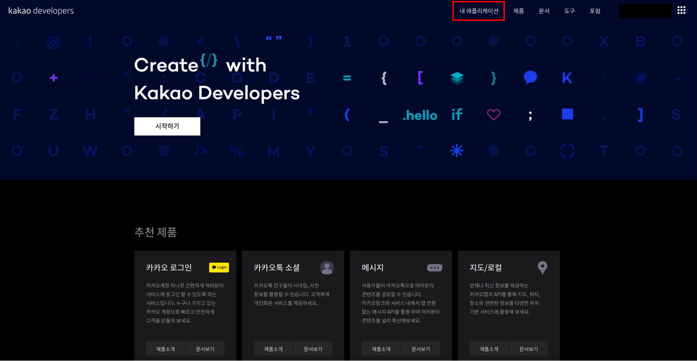
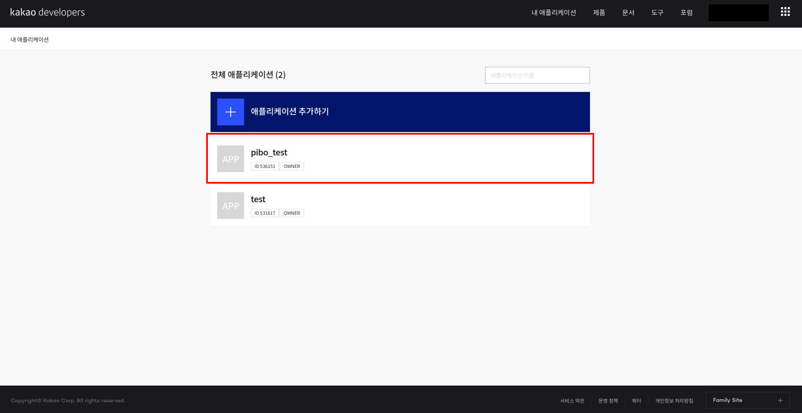
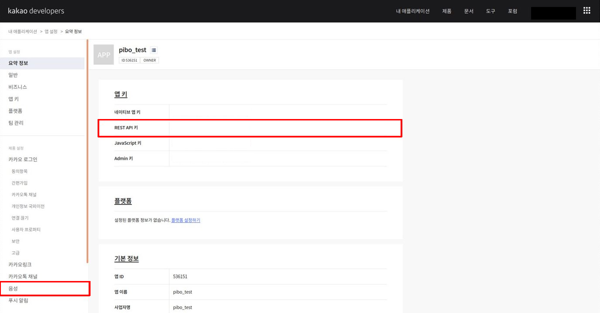
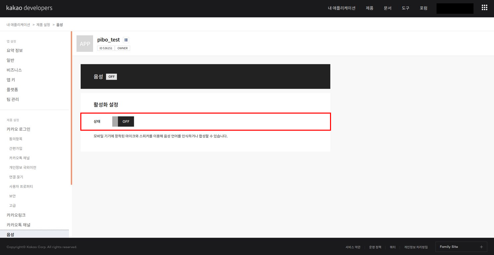
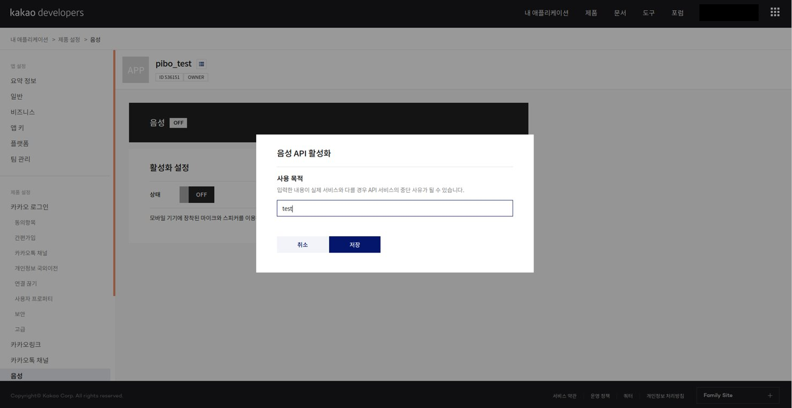
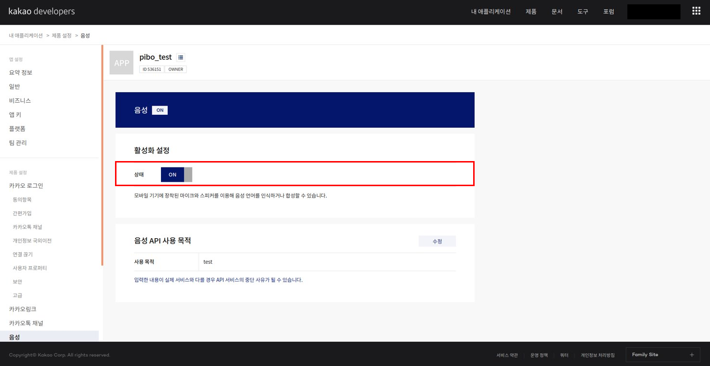
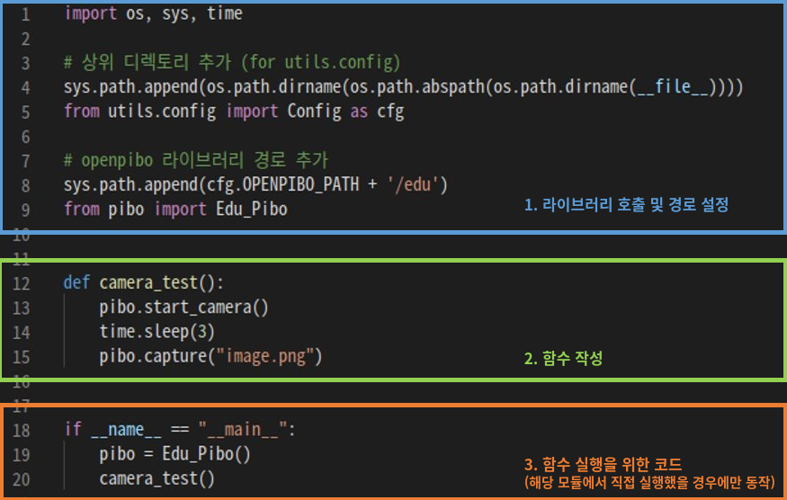
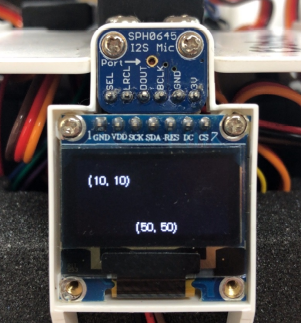

##  1. 설치 및 실행

### 1.1 설치

```shell
~ $ git clone "https://github.com/themakerrobot/openpibo.git"
~ $ git clone "https://github.com/themakerrobot/openpibo-data.git"
~ $ git clone "https://github.com/themakerrobot/openpibo-example.git"
~ $ cd openpibo
~/openpibo $ sudo ./install.sh
...
REBOOT NOW? [y/N] # y입력 또는 N 입력 후 sudo reboot

~/openpibo $ sudo ./control_mic_volume.sh
```

- openpibo: 파이보 기능 구현을 위한 라이브러리입니다.

- openpibo-data: 기능 구현에 필요한 실험 데이터 및 모델 파일입니다.

- openpibo-example: 각 기능별 예제 파일 모음입니다.

  

#### 1.1.1 APIs

- **Kakao open API** (https://developers.kakao.com/)

  *Speech* 기능을 사용하기 위해  [kakao developers](https://developers.kakao.com/) 회원가입 후 REST API 키를 발급받아야 합니다.

  1. 로그인 후 [내 애플리케이션] 클릭

     

  2. [애플리케이션 추가하기] 클릭

     

  3. 앱 이름 및 사업자명 입력 후 저장

     

  4. 새로 생성한 애플리케이션 클릭

     

  5. config.py에 발급받은 REST API 키 입력 후, 왼쪽의 [음성] 클릭

     

     - `openpibo-example/utils/config.py`의 KAKAO_ACCOUNT에 발급받은 REST API 키 입력

     ```python
     # openpibo-example/utils/config.py
     
     class Config:
       OPENPIBO_PATH="/home/pi/openpibo"
       OPENPIBO_DATA_PATH="/home/pi/openpibo-data"
       TESTDATA_PATH =OPENPIBO_DATA_PATH+"/testdata"
       PROC_PATH =OPENPIBO_DATA_PATH+"/proc"
       MODEL_PATH=OPENPIBO_DATA_PATH+"/models"
       KAKAO_ACCOUNT="YOUR REST API KEY"		# 발급받은 REST API 키 입력
     ```

  6. 활성화 설정의 [OFF] 버튼 클릭

     

  7. 사용 목적 입력 후 저장

     

  8. 활성화 설정의 상태가 [ON]으로 바뀌면 완료

     

### 1.2 실행

#### 1.2.1 예제 파일 생성

파이보의 기능 테스트를 위한 예제 파일을 생성합니다. 

`openpibo/edu/pibo.py`에 있는 Edu_Pibo 클래스를 호출하여 객체 생성 후 클래스 내의 메서드를 사용합니다.

코드는 아래와 같이 구성할 수 있습니다.



1. 라이브러리 호출 및 경로 설정
   - 코드 작성에 필요한 라이브러리를 호출하고 경로를 설정합니다.
   - `openpibo/edu/pibo.py`에 있는 Edu_Pibo 클래스를 호출합니다. ( `from {module} import {class}` )
2. 함수 작성
   - Edu_Pibo 클래스 내의 메서드를 활용하여 테스트 코드를 작성합니다.
   - `time.sleep()`: 일정 시간동안 프로세스를 정지하는 함수입니다. (단위: 초 / `import time`)
3. 함수 실행을 위한 코드 (`if __name__ == "__main__"` )
   - `__name__`: 현재 모듈의 이름을 담고 있는 내장 변수입니다.
   - 해당 프로그램을 직접 실행했을 경우, 참이 되어 main 함수를 실행합니다.
   - 다른 프로그램에서 import하여 사용할 경우, main 함수는 실행하지 않습니다.

#### 1.2.2 예제 파일 실행

예제파일은 아래의 명령어로 실행할 수 있습니다.

```shell
~ $ cd {폴더명}
~/{폴더명} $ sudo python3 {파일명}
```

아래는 `openpibo-example/test` 폴더 내에 있는 pibo_test.py를 실행하는 예제입니다.

```shell
~ $ cd openpibo-example/test
~/openpibo-example/test $ sudo python3 pibo_test.py
```


## 2. 교육용 APIs

각 메서드의 반환값은 다음과 같은 형식으로 구성됩니다.

- 실행 성공: `{"result": True, "errcode": 0, "errmsg": "Success", "data": data 또는 None}`
  
  - 메서드에서 반환되는 데이터가 있을 경우 해당 데이터가 출력되고, 없으면 None이 출력됩니다.
- 실행 실패: `{"result": False, "errcode": errcode, "errmsg": "errmsg", "data": None}`
  - `errcode`에 err 숫자 코드가, `errmsg`에 해당 error 발생 원인이 출력됩니다.
  - err 숫자코드의 의미와 발생 원인은 다음과 같습니다.
    
    -   `0` : 메서드 실행 성공
    - `-1` : Argument error - 메서드 실행에 필요한 필수 인자 값 미기입
    - `-2` : Extension error - filename에 확장자 미기입 또는 잘못된 확장자 형식 입력
    - `-3` : NotFound error - 존재하지 않는 데이터 입력
    - `-4` : Exist error - 이미 존재하는 데이터의 중복 생성
    - `-5` : Range error - 지정된 범위를 벗어난 값 입력
    - `-6` : Running error - 이미 실행 중인 함수의 중복 사용
    - `-7` : Syntax error - 잘못된 형식의 인자 값 입력
    - `-8` : Exception error - 위 error 이외의 다른 이유로 메서드 실행에 실패한 경우
  
- `get_codeMean(errcode)`

  - 기능: err 숫자코드의 의미를 조회합니다.
  - 매개변수
    - errcode: 조회하고자 하는 errcode 숫자
  - 반환값
    - 성공: {"result": True, "errcode": 0, "errmsg": "Success", "data": errcode 의미}
    - 실패: {"result": False, "errcode": errcode, "errmsg": "errmsg", "data": None}

  ```python
  pibo = Edu_Pibo()
  pibo.get_codeMean(-3)
  ```

### 2.1 Audio

> mp3, wav 파일을 재생 및 정지합니다.

- `play_audio(filename, out, volume)`

  - 기능: mp3 파일 또는 wav 파일을 재생합니다.
  - 매개변수
    - filename: 재생할 파일의 경로(mp3 / wav)
    - out: 출력대상(local-3.5mm잭 / hdmi / both) [default: local]
    - volume: 음량 크기 (단위: mdB=1/1000dB) [default: -2000]
  - 반환값
    - 성공: {"result": True, "errcode": 0, "errmsg": "Success", "data": None}
    - 실패: {"result": False, "errcode": errcode, "errmsg": "errmsg", "data": None}

  ```python
  pibo = Edu_Pibo()
  pibo.play(filename=cfg.TESTDATA_PATH+"/test.mp3", out='local', volume=-2000)
  ```

- `stop_audio()`

  - 기능: 오디오 재생을 정지합니다.
  - 반환값
    - 성공: {"result": True, "errcode": 0, "errmsg": "Success", "data": None}
    - 실패: {"result": False, "errcode": errcode, "errmsg": "errmsg", "data": None}

### 2.2 Neopixel

> 파이보의 눈 색상을 제어합니다.

- `eye_on(color)`

  - 기능: LED를 켭니다.

  - 매개변수

    - color: 색상 - RGB (0~255 숫자) / color(영어 대소문자 모두 가능)

      ( color_list: black, white, red, orange, yellow, green, blue, aqua, purple, pink )
    

  ```python
  pibo = Edu_Pibo()
  pibo.eye_on(255,0,0)	# 양쪽 눈 제어
  pibo.eye_on(0,255,0,0,0,255) # 양쪽 눈 개별 제어
  
  pibo.eye_on('Red') # 양쪽 눈 제어('RED', 'red' 가능)
  pibo.eye_on('aqua', 'pink') # 양쪽 눈 개별 제어
  ```

  > 두 가지 방식을 동시에 사용할 수는 없습니다.
  >
  > pibo.eye_on('blue', 0, 255, 0) (X)

  - 반환값
    - 성공: {"result": True, "errcode": 0, "errmsg": "Success", "data": None}
    - 실패: {"result": False, "errcode": errcode, "errmsg": "errmsg", "data": None}

- `eye_off()`

  - 기능: LED를 끕니다.
  - 반환값
    - 성공: {"result": True, "errcode": 0, "errmsg": "Success", "data": None}
    - 실패: {"result": False, "errcode": errcode, "errmsg": "errmsg", "data": None}


- `add_color(color, rgb)` 

  - 기능: colordb에 원하는 색상을 추가합니다.
  - 매개변수
    - color: 추가할 색상 이름
    - rgb: RGB (0~255 숫자) 
  - 반환값
    - 성공: {"result": True, "errcode": 0, "errmsg": "Success", "data": None}
    - 실패: {"result": False, "errcode": errcode, "errmsg": "errmsg", "data": None}

  ```python
  pibo = Edu_Pibo()
  pibo.add_color('lime', 191,255,0)
  ```

- `get_colordb()`

  - 기능: 사용 중인 colordb를 확인합니다. (`pibo.eye_on()`에 입력할 수 있는 color 목록 조회 )
  - 반환값
    - 성공: {"result": True, "errcode": 0, "errmsg": "Success", "data": 현재 사용 중인 colordb}
    - 실패: {"result": False, "errcode": errcode, "errmsg": "errmsg", "data": None}

  ```python
  pibo = Edu_Pibo()
  pibo.get_colordb()	# {'black': (0, 0, 0), 'white': (255, 255, 255), 'red': (255, 0, 0), ...}
  ```

- `init_colordb()`

  - 기능: colordb를 기존에 제공하는 colordb 상태로 초기화합니다. 
  - 반환값
    - 성공: {"result": True, "errcode": 0, "errmsg": "Success", "data": None}
    - 실패: {"result": False, "errcode": errcode, "errmsg": "errmsg", "data": None}

- `save_colordb(filename)`

  - 기능: colordb를 파일로 저장합니다.
  - 매개변수
    - filename: 저장할 데이터베이스 파일 이름
  - 반환값
    - 성공: {"result": True, "errcode": 0, "errmsg": "Success", "data": None}
    - 실패: {"result": False, "errcode": errcode, "errmsg": "errmsg", "data": None}

  ```python
  pibo = Edu_Pibo()
  pibo.save_colordb('./new_colordb')
  # 현재 경로 위치에 new_colordb 이름으로 저장
  ```

- `load_colordb(filename)`

  - 기능: colordb를 불러옵니다.
  - 매개변수
    - filename: 불러올 colordb 파일 이름
  - 반환값
    - 성공: {"result": True, "errcode": 0, "errmsg": "Success", "data": None}
    - 실패: {"result": False, "errcode": errcode, "errmsg": "errmsg", "data": None}

  ```python
  pibo = Edu_Pibo()
  # 기존에 제공되는 colordb를 new_colordb로 교체합니다.
  # pibo.get_colordb()를 통해 현재 사용중인 colordb를 확인할 수 있습니다. 
  pibo.load_colordb('new_colordb')
  ```

- `delete_color(color)`

  - 기능: colordb에 등록된 색상을 삭제합니다.
  - 매개변수
    - color: 삭제할 색상 이름
  - 반환값
    - 성공: {"result": True, "errcode": 0, "errmsg": "Success", "data": None}
    - 실패: {"result": False, "errcode": errcode, "errmsg": "errmsg", "data": None}

  ```python
  pibo = Edu_Pibo()
  pibo.delete_color('lime')
  ```

### 2.3 Device

> 파이보 디바이스 상태를 확인합니다.

- `check_device(system)`

  - 기능: 디바이스의 상태를 확인합니다. (일회성)
  - 매개변수
    - system: 확인할 디바이스 (system, baterry - 영어 대소문자 모두 가능)
      - system 입력으로 PIR, TOUCH, DC_CONN, BUTTON의 상태를 조회할 수 있습니다.
  - 반환값
    - 성공: {"result": True, "errcode": 0, "errmsg": "Success", "data": Device로부터 받은 응답}
    - 실패: {"result": False, "errcode": errcode, "errmsg": "errmsg", "data": None}

  ```python
  pibo = Edu_Pibo()
  pibo.check_device("battery")
  ```

- `start_devices(func)`

  - 기능: 디바이스의 상태를 확인합니다.
  - 매개변수
    - func: Device로부터 받은 응답을 확인하기 위한 함수
  - 반환값
    - 성공: {"result": True, "errcode": 0, "errmsg": "Success", "data": None}
    - 실패: {"result": False, "errcode": errcode, "errmsg": "errmsg", "data": None}

  ```python
  def msg_device(msg):
      print(msg)
  
  def check_devices():
      pibo = Edu_Pibo()
      pibo.start_devices(msg_device)
  ```

- `stop_devices()`

  - 기능: 디바이스의 상태 확인을 종료합니다.
  - 반환값
    - 성공: {"result": True, "errcode": 0, "errmsg": "Success", "data": None}
    - 실패: {"result": False, "errcode": errcode, "errmsg": "errmsg", "data": None}

### 2.4 Motion

> 파이보의 움직임을 제어합니다.
>
> speed와 accel이 None이면 이전에 설정한 값으로 제어합니다.

- `motor(n, position, speed, accel)`

  - 기능: 모터 1개를 제어합니다.
  - 매개변수
    - n: 모터 번호 (0~9)

    - position: 모터 각도

      ( 모터별 허용 각도 범위 절대값: [25,35,80,30,50,25,25,35,80,30] / ex. 0번 모터는 -25 ~ 25 범위의 모터 각도를 가집니다.)

    - speed: 모터 속도 (0~255) [default: None - 사용자가 이전에 설정한 값으로 제어]

    - accel: 모터 가속도 (0~255) [default: None- 사용자가 이전에 설정한 값으로 제어]
  - 반환값
    - 성공: {"result": True, "errcode": 0, "errmsg": "Success", "data": None}
    - 실패: {"result": False, "errcode": errcode, "errmsg": "errmsg", "data": None}

  ```python
  pibo = Edu_Pibo()
  pibo.motor(2, 30, 100, 10)
  ```

- `motors(positions, speed, accel)`

  - 기능: 10개의 모터를 개별 제어합니다.
  - 매개변수
    - position: 0-9번 모터 각도 배열( [...] ) 
    
      ( 모터별 허용 각도 범위 절대값: [25,35,80,30,50,25,25,35,80,30] / ex. 0번 모터는 -25 ~ 25 범위의 모터 각도를 가집니다.)
    
    - speed: 0-9번 모터 속도 (0~255) 배열( [...] ) [default: None - 사용자가 이전에 설정한 값으로 제어]
    
    - accel: 0-9번 모터 가속도 (0~255) 배열( [...] ) [default: None - 사용자가 이전에 설정한 값으로 제어]
  - 반환값
    - 성공: {"result": True, "errcode": 0, "errmsg": "Success", "data": None}
    - 실패: {"result": False, "errcode": errcode, "errmsg": "errmsg", "data": None}

  ```python
  pibo = Edu_Pibo()
  pibo.motors(positions=[0,0,0,10,0,10,0,0,0,20], speed=[0,0,0,15,0,10,0,0,0,10], accel=[0,0,10,5,0,0,0,0,5,10])
  ```

- `motors_movetime(positions, movetime)`

  - 기능: 입력한 시간 내에 모든 모터를 특정 위치로 이동합니다.
  - 매개변수
    - positions: 0-9번 모터 각도 배열( [...] )
    
      ( 모터별 허용 각도 범위 절대값: [25,35,80,30,50,25,25,35,80,30] / ex. 0번 모터는 -25 ~ 25 범위의 모터 각도를 가집니다.)
    
    - movetime: 모터 이동 시간(ms) - 모터가 정해진 위치까지 이동하는 시간 [default: None]
      
      - movetime이 있으면 해당 시간까지 모터를 이동시키기 위한 속도, 가속도 값을 계산하여 모터를 제어하고, movetime이 없으면 이전에 설정한 속도, 가속도 값에 의해 모터를 이동시킵니다.
  - 반환값
    -  성공: {"result": True, "errcode": 0, "errmsg": "Success", "data": None}
    -  실패: {"result": False, "errcode": errcode, "errmsg": "errmsg", "data": None}

  ```python
  pibo = Edu_Pibo()
  pibo.motors_movetime(positions=[0,0,30,20, 30,0, 0,0,30,20], movetime=1000)
  # 1000ms 내에 모든 모터가 [0,0,30,20,30,0,0,0,30,20]의 위치로 이동 
  ```

- `get_motion(name)`

  - 기능: 모션 종류 및 정보를 조회합니다.
    - `set_motion(name, cycle)`에서 사용할 name 값을 조회할 수 있습니다.
    - `get_motion()`으로 모션 목록을 조회한 후, 모션을 하나 선택하여 `get_motion(name)`에서 해당 모션에 대한 상세 정보를 얻을 수 있습니다.
  - 매개변수

    - name: 모션 이름
  - 반환값
    - 성공: {"result": True, "errcode": 0, "errmsg": "Success", "data": motion profile로부터 받은 응답}
    - 실패: {"result": False, "errcode": errcode, "errmsg": "errmsg", "data": None}

  ```python
  pibo = Edu_Pibo()
  pibo.get_motion()	# ['stop', 'stop_body', 'sleep', 'lookup', 'left', ...]
  pibo.get_motion("sleep")	# {'comment': 'sleep', 'init': [0, 0, -70, -25, 0, 15, 0, 0, 70, 25], 'init_def': 0, ...}
  ```

  > [전체 모션 리스트]
  >
  > stop, stop_body, sleep, lookup, left, left_half, right, right_half, foward1-2, backward1-2, step1-2, hifive, cheer1-3, wave1-6, think1-4, wake_up1-3, hey1-2, yes_h, no_h, breath1-3, breath_long, head_h, spin_h, clapping1-2, hankshaking, bow, greeting, hand1-4, foot1-2, speak1-2, speak_n1-2, speak_q, speak_r1-2, speak_l1-2, welcome, happy1-3, excite1-2, boring1-2, sad1-3, handup_r, handup_l, look_r, look_l, dance1-5, motion_test, test1-4
  >
  > (참고: foward1-2는 forward1, forward2  두 종류가 있음을 의미합니다.)

- `set_motion(name, cycle)`

  - 기능: 모션의 동작을 실행합니다.
  - 매개변수
    - name: 모션 이름
    - cycle: 모션 반복 횟수 [default: 1]
  - 반환값
    - 성공: {"result": True, "errcode": 0, "errmsg": "Success", "data": None}
    - 실패: {"result": False, "errcode": errcode, "errmsg": "errmsg", "data": None}

  ```python
  pibo = Edu_Pibo()
  pibo.set_motion("dance1", 5)
  ```

### 2.5 OLED

> OLED Display에 문자, 이미지, 도형을 출력합니다.

OLED 관련 메서드에서는 좌측상단, 우측하단 튜플을 기준으로 문자나 도형을 그립니다. 

만약 좌측상단 좌표가 (10, 10), 우측하단 좌표가 (50, 50)라면 위치는 아래와 같습니다.

 

- `draw_text(points, text, size)`

  - 기능: 문자를 씁니다. (한글/영어)
  - 매개변수
    -  points: 문자열의 좌측상단 좌표 튜플(x,y)
    - text: 문자열 내용
    - size: 폰트 크기 [default: 10]
  - 반환값
    - 성공: {"result": True, "errcode": 0, "errmsg": "Success", "data": None}
    - 실패: {"result": False, "errcode": errcode, "errmsg": "errmsg", "data": None}

  ```python
  pibo = Edu_Pibo()
  pibo.draw_text((10, 10), '안녕하세요.', 15)
  ```

- `draw_image(filename)`

  - 기능: 이미지를 그립니다. (128X64 png 파일)
    - 128X64 png 파일 외에는 지원하지 않습니다.
  - 매개변수
    - filename: 이미지 파일의 경로
  - 반환값
    - 성공: {"result": True, "errcode": 0, "errmsg": "Success", "data": None}
    - 실패: {"result": False, "errcode": errcode, "errmsg": "errmsg", "data": None}

  ```python
  pibo = Edu_Pibo()
  pibo.draw_image(cfg.TESTDATA_PATH +"/clear.png")
  ```

- `draw_figure(points, shape, fill)`

  - 기능: 도형을 그립니다. (사각형, 원, 선)
  - 매개변수
    - points: 선 - 시작 좌표, 끝 좌표(x, y, x1, y1) / 사각형, 원 - 좌측상단, 우측하단 좌표 튜플(x, y, x1, y1)
    - shape: 도형 종류 - rectangle, circle, line
    - fill: True(채움), False(채우지 않음) [default: False]
  - 반환값
    - 성공: {"result": True, "errcode": 0, "errmsg": "Success", "data": None}
    - 실패: {"result": False, "errcode": errcode, "errmsg": "errmsg", "data": None}

  ```python
  pibo = Edu_Pibo()
  pibo.draw_figure((10,10,30,30), "rectangle", True)
  pibo.draw_figure((70,40,90,60), "circle", False)
  pibo.draw_figure((15,15,80,50), "line")
  ```

- `invert()`

  - 기능: 이미지를 반전시킵니다. (색 반전)
  - 반환값
    - 성공: {"result": True, "errcode": 0, "errmsg": "Success", "data": None}
    - 실패: {"result": False, "errcode": errcode, "errmsg": "errmsg", "data": None}

- `show_display()`

  - 기능: 화면에 표시합니다.
  - 반환값
    - 성공: {"result": True, "errcode": 0, "errmsg": "Success", "data": None}
    - 실패: {"result": False, "errcode": errcode, "errmsg": "errmsg", "data": None}

- `clear_display()`  

  - 기능: 화면을 지웁니다.
  - 반환값
    - 성공: {"result": True, "errcode": 0, "errmsg": "Success", "data": None}
    - 실패: {"result": False, "errcode": errcode, "errmsg": "errmsg", "data": None}

### 2.6 Speech

> 파이보의 마이크와 스피커로 사람의 음성 언어를 인식하거나 합성할 수 있습니다.

- `translate(string, to)`

  - 기능: 구글 번역기를 이용해 문장을 번역합니다.
  - 매개변수
    - string: 번역할 문장
    - to: 번역할 언어(한글-ko / 영어-en) [default: ko]
  - 반환값
    - 성공: {"result": True, "errcode": 0, "errmsg": "Success", "data": 번역된 문장}
    - 실패: {"result": False, "errcode": errcode, "errmsg": "errmsg", "data": None}

  ```python
  pibo = Edu_Pibo()
  pibo.translate('즐거운 금요일', 'en')
  ```

- `tts(string, filename)`

  - 기능: Text(문자)를 Speech(음성)로 변환합니다.

  - 매개변수
    - string: 변환할 문장

      - speak

        - 기본적으로 모든 음성은 태그로 감싸져야 합니다.
        - 태그 하위로 `,`를 제외한 모든 태그가 존재할 수 있습니다.
        - 문장, 문단 단위로 적용하는 것을 원칙으로 합니다. 한 문장 안에서 단어별로 태그를 감싸지 않습니다.

        ```
        <speak> 안녕하세요. 반가워요. </speak>
        ```
        
      - voice
      
        - 음성의 목소리를 변경하기 위해 사용하며, name attribute를 통해 원하는 목소리를 지정합니다. 제공되는 목소리는 4가지입니다.
      
        ```
        - WOMAN_READ_CALM: 여성 차분한 낭독체 (default)
        - MAN_READ_CALM: 남성 차분한 낭독체
        - WOMAN_DIALOG_BRIGHT: 여성 밝은 대화체
        - MAN_DIALOG_BRIGHT: 남성 밝은 대화체
        ```
      
        - 하위로 `,`를 제외한 모든 태그(kakao: effet, prosody, break, audio, say-as, sub)가 존재할 수 있습니다.
        - 문장, 문단 단위로 적용하는 것을 원칙으로 합니다. 한 문장 안에서 단어별로 태그를 감싸지 않습니다.
      
        ```
        <speak>
              <voice name="WOMAN_READ_CALM"> 지금은 여성 차분한 낭독체입니다.</voice>
              <voice name="MAN_READ_CALM"> 지금은 남성 차분한 낭독체입니다.</voice>
              <voice name="WOMAN_DIALOG_BRIGHT"> 안녕하세요. 여성 밝은 대화체예요.</voice>
              <voice name="MAN_DIALOG_BRIGHT"> 안녕하세요. 남성 밝은 대화체예요.</voice>
        </speak>
        ```
      
    - filename: 저장할 파일 이름(mp3, wav) [default: tts.mp3]

  - 반환값

    - 성공: {"result": True, "errcode": 0, "errmsg": "Success", "data": None}
    - 실패: {"result": False, "errcode": errcode, "errmsg": "errmsg", "data": None}

  ```python
  pibo = Edu_Pibo()
  pibo.tts("<speak><voice name='MAN_READ_CALM'>안녕하세요. 반갑습니다.<break time='500ms'/></voice></speak>", "tts.mp3")
  ```

- `stt(filename, timeout)`

  - 기능: Speech(음성)를 Text(문자)로 변환합니다.
  - 매개변수
    - filename: 저장할 파일 이름 [default: stream.wav]
    - timeout: 녹음할 시간(초) [default: 5초]
  - 반환값
    - 성공: {"result": True, "errcode": 0, "errmsg": "Success", "data": 변환된 문장}
    - 실패: {"result": False, "errcode": errcode, "errmsg": "errmsg", "data": None}

  ```python
  pibo = Edu_Pibo()
  pibo.stt()
  ```

- `conversation(q)`

  - 기능: 질문에 대한 답을 추출합니다.
  - 매개변수
    - q: 질문
  - 반환값
    - 성공:{"result": True, "errcode": 0, "errmsg": "Success", "data": 질문에 대한 응답}
    - 실패: {"result": False, "errcode": errcode, "errmsg": "errmsg", "data": None}
  
  ```python
  pibo = Edu_Pibo()
  pibo.conversation('주말에 뭐하지?')
  ```

### 2.7 Vision

> 파이보 영상처리 관련 동작을 수행합니다. (카메라 기능, 얼굴 인식/학습, 객체/바코드/문자 인식)
>

- `start_camera()`
  
  - 기능: 카메라가 촬영하는 영상을 OLED에 보여줍니다.
  - 반환값
    - 성공: {"result": True, "errcode": 0, "errmsg": "Success", "data": None}
    - 실패: {"result": False, "errcode": errcode, "errmsg": "errmsg", "data": None}
  
- `stop_camera()`

  - 기능: 카메라를 종료합니다.
  - 반환값
    - 성공: {"result": True, "errcode": 0, "errmsg": "Success", "data": None}
    - 실패: {"result": False, "errcode": errcode, "errmsg": "errmsg", "data": None}

- `capture(filename)` 

  - 기능: 사진을 촬영하여 이미지로 저장합니다.
  - 매개변수
    
    - filename: 저장할 파일 이름 [default: capture.png]
    
      (이미지 파일 형식 기입 필수 - jpg, jpeg, png, bmp)
  - 반환값
    
    - 성공: {"result": True, "errcode": 0, "errmsg": "Success", "data": None}
    - 실패: {"result": False, "errcode": errcode, "errmsg": "errmsg", "data": None}

  ```python
  pibo = Edu_Pibo()
  pibo.capture('test.png')
  ```

- `search_object()`

  - 기능: 이미지 안의 객체를 인식합니다.

    - 인식 가능한 사물 목록

      ["background", "aeroplane", "bicycle", "bird", "boat", "bottle", "bus", "car", "cat", "chair", "cow", "diningtable", "dog", "horse", "motorbike", "person", "pottedplant", "sheep", "sofa", "train", "tvmonitor"]

  - 반환값

    - 성공: {"result": True, "errcode": 0, "errmsg": "Success", "data": {"name": 이름, "score": 점수, "position": 사물좌표(startX, startY, endX, endY)}}
    - 실패: {"result": False, "errcode": errcode, "errmsg": "errmsg", "data": None}

- `search_qr()`

  - 기능: 이미지 안의 QR 코드 및 바코드를 인식합니다.
  - 반환값
    - 성공: {"result": True, "errcode": 0, "errmsg": "Success", "data": {"data": 내용, "type": 바코드/QR코드}}
    - 실패: {"result": False, "errcode": errcode, "errmsg": "errmsg", "data": None}

- `search_text()` 

  - 기능: 이미지 안의 문자를 인식합니다.
  - 반환값
    - 성공: {"result": True, "errcode": 0, "errmsg": "Success", "data": 인식된 문자열}
    - 실패: {"result": False, "errcode": errcode, "errmsg": "errmsg", "data": None}

- `search_color()`

  - 기능: 이미지(단색 이미지) 안의 색상을 인식합니다. 

    (Red, Orange, Yellow, Green, Skyblue, Blue, Purple, Magenta)

  - 반환값

    - 성공: {"result": True, "errcode": 0, "errmsg": "Success", "data": 인식된 색상}
    - 실패: {"result": False, "errcode": errcode, "errmsg": "errmsg", "data": None}

- `detect_face()`

  - 기능: 이미지 안의 얼굴을 탐색합니다.
  - 반환값
    - 성공: {"result": True, "errcode": 0, "errmsg": "Success", "data": 얼굴 좌표(startX, startY, endX, endY)}
    - 실패: {"result": False, "errcode": errcode, "errmsg": "errmsg", "data": None}

- `search_face(filename)`

  - 기능: 이미지 안의 얼굴을 인식하여 성별과 나이를 추측하고, facedb를 바탕으로 인식한 얼굴의 이름과 정확도를 제공합니다. (인식한 얼굴 중 가장 크게 인식한 얼굴에 적용됩니다.)
  - 매개변수
    
    - filename: 저장할 파일 이름 [default: 'face.png']
    
      (이미지 파일 형식 기입 필수 - jpg, jpeg, png, bmp)
  - 반환값
    - 성공: {"result": True, "errcode": 0, "errmsg": "Success", "data": {"name": 이름, "score": 정확도, "gender": 성별, "age": 나이}} (정확도 0.4 이하 동일인 판정)
    - 실패: {"result": False, "errcode": errcode, "errmsg": "errmsg", "data": None}

  ```python
  pibo = Edu_Pibo()
  pibo.search_face("face.png")
  ```

- `train_face(name)`

  - 기능: 사진 촬영 후 얼굴을 학습합니다. (인식된 얼굴 중 가장 크게 인식한 얼굴에 적용됩니다.)
  - 매개변수
    - name: 학습할 얼굴의 이름
  - 반환값
    - 성공: {"result": True, "errcode": 0, "errmsg": "Success", "data": None}
    - 실패: {"result": False, "errcode": errcode, "errmsg": "errmsg", "data": None}

  ```python
  pibo = Edu_Pibo()
  pibo.train_face("kim")
  ```

- `get_facedb()`

  - 기능: 사용 중인 facedb를 확인합니다.
  - 반환값
    - 성공: {"result": True, "errcode": 0, "errmsg": "Success", "data": 현재 사용 중인 facedb}
    - 실패: {"result": False, "errcode": errcode, "errmsg": "errmsg", "data": None}
  
- `init_facedb()`

  - 기능: facedb를 초기화합니다.
  - 반환값
    - 성공: {"result": True, "errcode": 0, "errmsg": "Success", "data": None}
    - 실패: {"result": False, "errcode": errcode, "errmsg": "errmsg", "data": None}

- `save_facedb(filename)`

  - 기능: facedb를 파일로 저장합니다.
  - 매개변수
    - filename: 저장할 데이터베이스 파일 이름
  - 반환값
    - 성공: {"result": True, "errcode": 0, "errmsg": "Success", "data": None}
    - 실패: {"result": False, "errcode": errcode, "errmsg": "errmsg", "data": None}

  ```python
  pibo = Edu_Pibo()
  pibo.save_facedb("./facedb")
  ```

- `load_facedb(filename)`

  - 기능: facedb를 불러옵니다.
  - 매개변수
    - filename: 불러올 facedb 파일 이름
  - 반환값
    - 성공: {"result": True, "errcode": 0, "errmsg": "Success", "data": None}
    - 실패: {"result": False, "errcode": errcode, "errmsg": "errmsg", "data": None}

  ```python
  pibo = Edu_Pibo()
  pibo.load_facedb("facedb")
  ```


- `delete_face(name)`

  - 기능: facedb에 등록된 얼굴을 삭제합니다.
  - 매개변수
    - name: 삭제할 얼굴 이름
  - 반환값
    - 성공: {"result": True, "errcode": 0, "errmsg": "Success", "data": None}
    - 실패: {"result": False, "errcode": errcode, "errmsg": "errmsg", "data": None}

  ```python
  pibo = Edu_Pibo()
  pibo.delete_face("kim")
  ```
