# 교육용 라이브러리

> PIBO 교육용 라이브러리입니다. 아래와 같은 폴더들로 구성되어 있습니다.

1. openpibo: 기능 구현을 위한 라이브러리
3. openpibo-example: 각 분야 예제 파일 모음
3. openpibo-data: 기능 구현을 위한 실험 데이터/모델 파일
4. openpibo-tools: 교육에 필요한 tools
5. openpibo-final: 학습한 내용을 바탕으로 만드는 프로젝트


# 1. openpibo

> PIBO 기능 구현을 위한 라이브러리입니다.

```
.
├── lib
|   ├── audio
|   |   ├── README.md
|   |   └── audiolib.py
|   ├── device
|   |   ├── README.md
|   |   └── devicelib.py
|   ├── motion
|   |   ├── README.md
|   |   └── motionlib.py
|   ├── oled
|   |   ├── README.md
|   |   ├── oledlib.py
|   |   └── ...
|   ├── servo
|   |   ├── Makefile
|   |   ├── README.md
|   |   ├── config.hpp
|   |   ├── servo.cpp
|   |   └── servo.hpp
|   ├── speech
|   |   ├── README.md
|   |   └── speechlib.py
|   ├── vision
|   |   ├── README.md
|   |   ├── stream.py
|   |   └── visionlib.py
├── utils
|   ├── boot
|   |   ├── net_info.py
|   |   └── start.sh
|   ├── mic
|   |   ├── asroundrc
|   |   └── i2smic.sh
|   ├── README.md
|   └── config.py
├── INSTALL.md
├── README.md
├── install.sh
├── install_oled.sh
└── requirements.txt
```

- `lib`: PIBO 기능 구현을 위한 라이브러리 모음

  


## 1.1 PIBO Device

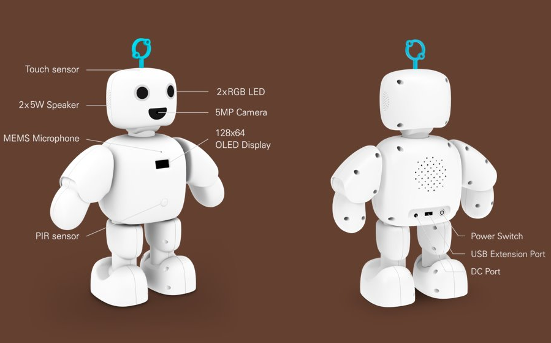

### 1.1.1 Audio

> mp3, wav 파일을 재생 및 정지합니다.

- omxplayer
  - 라즈베리파이에서 공식적으로 지원하는 미디어 프로그램 (오디오 및 비디오 파일 형식 재생)
  - 기본적인 명령행: `omxplayer <미디어 파일명>`

### 1.1.2 Device ==파이보 모듈 사진으로 변경==

> mcu(Atmega328p)를 제어합니다.

- Atmega328p

  - 자체 운영체제가 없어 외부 프로그램에서 C언어 형태로 프로그래밍하고 코드를 보드에 업로드하는 방식으로 동작
  - 주로 외부기기(센서, LCD, 모터) 제어에 많이 사용되며, 파이보에서는 PIR sensor, Neopixel, Touch sensor 제어에 사용

  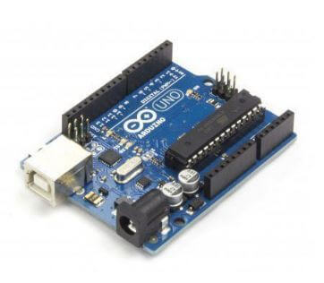 

- PIR Sensor

  - 적외선 감지 센서
  - 일정한 적외선을 띈 움직임이 있는 물체 감지
  - 무한 반복 트리거 동작 방식
    - HIGH 신호가 출력되는 Delay Time 내에 인체 또는 적외선 변화가 감지되면, 출력 신호 Delay Time이 초기화되며 출력 신호 유지 상태에서 다시 카운트 시작. 인체 또는 적외선 변화가 감지되지 않은 시점에서 2초 후 출력 신호는 LOW가 됨

   

- Neopixel

     - WS281x 칩이 내장된 LED
     - 어떤 모양이든 연결 가능하며 연결 배선이 간단
     - 단일 핀으로 모든 LED 개별 제어

     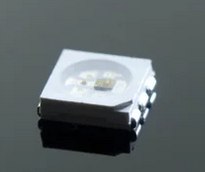 

- Touch Sensor

     - PCB 하단의 터치패드를 터치하면 터치 인식
     - 기구물에 부착하여 사용 (두께 3T 이하)
     - 전원인가 시 초기 출력 HIGH, 터치 시 OUTPUT LOW
     
      

### 1.1.3 Motion/Servo

> PIBO의 움직임을 제어합니다.

### 1.1.4 OLED

> OLED Display에 문자나 이미지를 출력합니다.

- SSD1306
  - 데이터를 화면에 출력
  - 통신 방식에 따라 SPI Type, I2C Type 존재

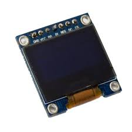 

### 1.1.5 Speech

> Kakao 음성 API를 사용하여 PIBO에 장착되어 있는 마이크와 스피커를 통해 사람의 음성 언어를 인식하거나 합성할 수 있습니다.

- MeCab
  - 일본에서 만든 형태소 분석 엔진
  - 언어, 사전 코퍼스에 의존하지 않는 범용적인 설계
  - 품사 독립적 설계
  - 각종 스크립트 언어 바인딩 (perl / ruby / python / java / C#)

### 1.1.6 Vision

> PIBO의 영상처리 관련 라이브러리입니다. (Local 실행 제약)
>
> 카메라 기능, 얼굴 인식, 객체/바코드/문자 인식 수행

- OpenCV (Open source Computer Vision)  --->   `import cv2`

  - 영상 처리 및 컴퓨터 비전 관련 오픈소스

  - 이미지, 영상처리, Object Detection, Motion Detection 등의 기능 제공

- Caffe

  - 딥러닝 프레임워크
  - 컴퓨터 비전 머신러닝에 특화되어 있으며 주로 C/C++ 기반으로 사용
  - Caffe Model Zoo에서 미리 훈련된 여러 네트워크를 바로 사용할 수 있음

- Dlib

  - 이미지 처리 및 기계 학습, 얼굴 인식 등을 할 수 있는 C++로 개발된 고성능의 라이브러리
  - facial landmarks를 통해 얼굴을 검출하는 기능이 많이 사용됨 (파이보에서는 5개의 face_landmarks를 찾습니다.)

- Tesseract

  - 다양한 운영체제를 지원하기 위한 OCR(Optical Character Recognition) 엔진

  - OCR 이미지로부터 텍스트를 인식하고, 추출
  - 오프라인 문자인식 기법으로 입력된 input 이미지의 특징점을 추출하고 그 특징점을 사용하여 문자 인식

- pyzbar

  - 비디오 스트림, 이미지 파일 및 이미지와 같은 다양한 소스에서 바코드를 판독할 수 있는 오픈소스 라이브러리

- numpy

  - 벡터, 행렬 등 수치 연산을 수행하는 선형대수 라이브러리
  - array(행렬) 단위로 데이터를 관리하며 이에 대해 연산 수행


## 1.2 사전 설치

- `install.sh` 설치 후 재부팅합니다.

```shell
~ $ git clone https://github.com/themakerrobot/openpibo.git
~ $ cd openpibo
~/openpibo $ sudo ./install.sh
...
REBOOT NOW? [y/N] # N 입력
~/openpibo $ sudo reboot
```

### 1.2.1 사전 학습

- `__init()__`: 클래스의 인스턴스 생성 시 자동으로 호출되는 메서드입니다.

  아래는 PIBO의 cDevice 클래스 코드의 일부입니다.

  ```python
  import serial
  import time
  from threading import Lock
  
  class cDevice:
    def __init__(self):
      self.code = {
      "VERSION":"10",
      "HALT":"11",
      "BUTTON":"13",
  	...
  ```

  ```python
  # 인스턴스 생성(a는 cDevice 클래스의 인스턴스)
  # 인스턴스 생성 시 자동으로 cDevice의 __init__ 메서드 호출
  a = cDevice()
  ```

- os: 환경 변수나 디렉터리, 파일 등의 OS 자원을 제어할 수 있게 해주는 모듈입니다.

  - `os.system("명령어")`: 시스템 자체의 프로그램이나 기타 명령어를 파이썬에서 호출 가능합니다.

    아래는 PIBO의 cMotion 클래스 코드의 일부입니다.

      ```python
    import os

    class cMotion:
      def __init__(self, conf=None):
        self.profile_path=conf.PROC_PATH+"/motion_db.json"
        with open(self.profile_path, 'r') as f:
          self.profile = json.load(f)

      def set_motor(self, no, position):
        os.system("servo write {} {}".format(no, position*10))
      ...
      ```

      ```shell
    # 실행 방법 1 (명령어 입력)
    ~ $ sudo servo write 2 30

    # 실행 방법 2
    ~/openpibo-example/motion $ sudo python3 motor_test.py
      ```


## 1.3 PIBO 기능 설명

> PIBO 기능 구현에 사용된 함수 설명입니다. 함수 적용을 통한 동작 설명은 2. openpibo-example에 상세히 기재되어 있습니다.

### 1.3.1 Audio 제어

> mp3, wav 파일을 재생 및 정지합니다.

#### cAudio 클래스

- `cAudio.play(filename, out, volume)`
  
  - 기능: mp3 또는 wav 파일을 재생합니다.
  - 매개변수
    - filename: 재생할 파일 경로(mp3 / wav)
    - out: 출력대상(local/hdmi/both), local(3.5mm 잭)
    - volume: 음량 단위: mdB(1/1000 dB)
  
  ```python
  cAudio.play(filename="test.mp3", out='local', volume=-2000)
  ```
  
- `cAudio.stop()`
  
  - 기능: 오디오 재생을 정지합니다.
  

### 1.3.2 Device 제어

> mcu(Atmega328p)를 제어합니다.

#### cDevice 클래스

- `cDevice.init()`
  - 기능: cDevice 클래스를 초기화합니다.

  - `Lock`

    - 해당 thread가 끝날 때까지 다른 thread의 접근을 막습니다.

    - `from threading import Lock`을 호출하여 사용합니다.

    ```python
    from threading import Lock
    
    class cDevice:
        def __init__(self):
            ...
            self.lock = Lock()
    ```
  
- `cDevice.locked()`
  - 기능: device가 사용중인지 확인합니다.

  - 반환값
    
    - True/False
  
- `cDevice.send_cmd(code, data)`
  
  - 기능:  Device에 메시지 코드/데이터를 전송하고 응답을 받습니다.
  - 매개변수
    - code: 메시지 코드
    - data: 메시지
  - 반환값
    - data: Device로부터 받은 응답
  
  ```python
  cDevice.send_cmd(cDevice.code['PIR'], "on")
  ```
  
- `cDevice.send_raw(raw)`
  - 기능: Device에 실제 메시지를 전송하고 응답을 받습니다.
  
  - `Lock`을 사용하여 먼저 진입한 thread가 작업을 완료할 때까지 다른 thread의 접근을 막습니다.
  
    - `self.lock.acquire()`와 `self.lock.release()`를 사용하여 thread의 실행 순서를 조정합니다.
  
      ( `self.lock.acquire()`: 상태를 잠금으로 변경합니다. / `self.lock.release()`: 잠금을 해제합니다. )
  
  -  매개변수
    
    - raw: 실제 전달되는 메시지
    
  - 반환값
    
    - data: Device로부터 받은 응답
  
  ```python
  cDevice.send_raw("#20:255,0,255:!")
  ```

#### 메시지 상세 설명

- cDevice.VERSION

  - get: 버전정보

- cDevice.HALT

  - set: 전원종료 요청(데이터 필요없음)
  - get: 전원종료 통보

- cDevice.DC_CONN

  - get: DC 잭 연결정보

- cDevice.BATTERY

  - get: 배터리정보

- cDevice.NEOPIXEL 

  - data:255, 255, 255

  - set: 네오픽셀 설정(R,G,B) (양쪽 눈 동일하게 설정)
  - get: "ok"

- cDevice.NEOPIXEL_EACH 

  - data: 255,255,255,255,255,255

  - set: 네오픽셀 설정(R,G,B,R,G,B) (양쪽 눈 각각 설정)
  - get: "ok"

- cDevice.PIR 

  - data: "on" or "off"

  - set: PIR sensor "on"(활성화)/"off"(비활성화)

- cDevice.TOUCH

- cDevice.SYSTEM 

    - data: (1)-(2)-(3)-(4)-(5)-(6)
    - (1): PIR 감지 - "person" or "nobody"
     - (2): Touch 감지 - "touch" or ""
    - (3): DC잭 연결감지 - "on" or "off"
    - (4): 버튼 감지 - "on" or ""
    - (5): 시스템리셋 - not support
    - (6): 전원종료 - "on" or ""

#### 참고자료

- 전체 메시지 리스트 ( `#(msg_type):(msg)!`의 형식으로 송수신 )

```
- MSG_TYPE_VERSION(10) ->  ex) #10:!
- MSG_TYPE_HALT(11) -> ex) #11:!
- MSG_TYPE_DC_CONN(14) -> ex) #14:!
- MSG_TYPE_BATTERY(15) -> ex) #15:!
- MSG_TYPE_REBOOT(17) -> ex) #17:!
- MSG_TYPE_NEOPIXEL(20) -> ex) #20:255,255,255!
- MSG_TYPE_NEOPIXEL_FADE(21) -> ex) #21:255,255,255,10!
- MSG_TYPE_NEOPIXEL_BRIGHTNESS(22) -> ex) #22:64!
- MSG_TYPE_NEOPIXEL_EACH(23) -> ex) #23:255,255,255,255,255,255!
- MSG_TYPE_NEOPIXEL_FADE_EACH(24) -> ex) #24:255,255,255,255,255,255,10!
- MSG_TYPE_NEOPIXEL_LOOP(25) -> ex) #25:2!  2 -- about 1s
- MSG_TYPE_NEOPIXEL_OFFSET_SET(26) -> ex) #26:255,255,255,255,255,255!
- MSG_TYPE_NEOPIXEL_EACH_ORG(28) -> ex) #28:255,255,255,255,255,255!
```
### 1.3.3 Motion 생성

> PIBO의 움직임을 제어합니다.

#### cMotion 클래스(모터제어 개별 프로그램 이용)

- `cMotion.init()`
  
  - 기능: cMotion 클래스를 초기화합니다.
  
- `cMotion.set_profile(path)`
  
  - 기능: 모터 프로파일을 설정합니다.
  - 매개변수
    - path: 모터 프로파일 경로
  
- ==`cMotion.set_motor(no, position)`==
  
  - 기능: 모터 1개를 특정 위치로 이동합니다.
  - 매개변수
    - no: 모터 번호
    - position: 모터 각도 (-80 ~ 80)
  
  ```python
  cMotion.set_motor(2, 30)
  ```
  
- `cMotion.set_motors(positions, movetime)`
  - 기능: 모든 모터를 특정 위치로 이동합니다.
  - 매개변수
    - positions: 0~9번 모터 각도 배열 [...]
    - movetime: 모터 이동 시간(ms) - 50ms 단위, 모터가 정해진 위치까지 이동하는 시간
  
  ```python
  cMotion.set_motors(positions=[0,0,30,20, 30,0, 0,0,30,20], movetime=1000) 
  # 1000ms내에 모든 모터는 [0,0,30,20, 30,0, 0,0,30,20]의 위치로 이동
  ```
  
- `cMotion.set_speed(n, speed)`
  
  - 기능: 모터 1개의 속도를 변경합니다.
  - 매개변수
    - no: 모터 번호
    - ==speed==: 모터 속도 (0~255)
  
  ```python
  cMotion.set_speed(2, 100)
  ```
  
- `cMotion.set_acceleration(n, accel)`
  
  - 기능: 모터 1개의 가속도를 변경합니다.
  - 매개변수
    - n: 모터 번호
  - ==accel==: 모터 가속도 (0~255)
  
  ```python
  cMotion.set_acceleration(8, 10)
  ```
  
- ==`cMotion.get_motion(name=None)`==

  - 기능: 모터 프로파일을 조회합니다.

  - 매개변수

    - name: 모터 프로파일 키 값

  - 반환값

    - data: 프로파일 객체

      - name != None: 해당 모션의 상세 정보 (init, pos  ...)
      
      - name == None: 모터 프로파일 전체 키 목록
      
        ( stop(2), sleep, lookup, left(2), right(2), forward(2), backward(2), step(2), hifive, cheer(3), wave(6), think(4), wake_up(3), hey(2), yes/no, breath(4), head, spin, clapping(2), hankshaking, bow, greeting, hand(4), foot(2),  speak(9),  welcome, 표정(10), handup(2), look(2), dance(5), test(5) -  괄호 안은 개수를 의미)
  
  ```python
  cMotion.get_motion()			# 모터 프로파일 키 값 출력
  cMotion.get_motion("wave6") 	# wave6의 상세 정보 출력
  ```
- `cMotion.set_motion(name, cycle)`
  
  - 기능: 모션 프로파일의 동작을 실행합니다.
  - 매개변수
    - name: 모션 프로파일 이름
    - cycle: 모션 반복 횟수 
  - 반환값
    - ret: 성공/실패
  
  ```python
  cMotion.set_motion(name="wave3", cycle=10)
  ```
  
- `cMotion.stop()`
  
  - 동작을 정지합니다.

#### ==cPyMotion== 클래스(모터컨트롤러와 직접 통신)

- `cPyMotion.init()`
  
  - 기능: cPyMotion 클래스를 초기화합니다.
  
- `cPyMotion.set_motor(n, degree)`
  - 기능: 모터 1개를 특정 위치로 이동합니다.
  - 매개변수
    - n: 모터 번호
    - degree: 모터 각도 (-80 ~ 80)
  - 반환값
    - ret: 성공/실패
  
  ```python
  cPyMotion.set_motor(2, -30)
  ```
  
- `cPyMotion.set_motors(d_lst)`
  - 기능: 모든 모터를 특정 위치로 이동합니다.
  - 매개변수
    - ==d_lst==: 0~9번 모터 각도 배열 [...]
  - 반환값
    - ret: 성공/실패
  
  ```python
  cPyMotion.set_motors([0,0,30,20, 30,0, 0,0,30,20])
  ```
  
- `cPyMotion.set_speed(n, val)`
  - 기능: 모터 1개의 속도를 변경합니다.
  - 매개변수
    - ==n==: 모터 번호
    - ==val==: 모터 속도 (0~255)
  - 반환값
    - ret: 성공/실패
  
  ```python
  cPyMotion.set_speed(2, 50)
  ```
  
- `cPyMotion.set_acceleration(n, val)`
  - 기능: 모터 1개의 가속도를 변경합니다.
  - 매개변수
    - ==n==: 모터 번호
    - ==val==: 모터 가속도 (0~255)
  - 반환값
    - ret: 성공/실패
  
  ```python
  cPyMotion.set_acceleration(8, 10)
  ```
  
- `cPyMotion.set_init()`
  - 기능: 모든 모터를 초기 상태로 이동시킵니다.
  - ==반환값==
    - ret: True

### 1.3.4 OLED  제어

> OLED Display에 문자나 이미지를 출력합니다.

cOled 클래스에서는 좌측상단, 우측하단 튜플을 기준으로 문자나 도형을 그립니다.

만약 좌측상단 좌표가 (10, 10), 우측하단 좌표가 (50, 50)라면 위치는 아래와 같습니다.


#### cOled 클래스

- `cOled.init()`

  - 기능: cOled 클래스를 초기화합니다.

- `cOled.set_font(filename, size)`

  - 기능: oled에 사용할 폰트를 설정합니다.
  - 매개변수
    - filename: 폰트 파일명
    - size: 폰트 크기

  ```python
  cOled.set_font("/home/pi/openpibo/lib/oled/NanumGothic.ttf", size=15)
  ```

- `cOled.draw_text(points, text)`

  - 기능: 문자 그리기 (한글, 영어 지원)
  - 매개변수
    - points: 문자열의 좌측상단 좌표 튜플 (x, y)
    - text: 문자열 내용

  ```python
  cOled.draw_text((10, 10), "즐거운 금요일")
  ```

- `cOled.draw_image(filename)`

  - 기능: 그림 그리기 (128X64 png 파일)
    - 다른 크기의 파일은 지원하지 않습니다.
  - 매개변수
    - filename: 그림 파일 경로

  ```python
  cOled.draw_image("clear.png")
  ```

- `cOled.draw_rectangle(points, fill)`

  - 기능: 사각형 그리기
  - 매개변수
    - points: 사각형의 좌측상단, 우측하단 좌표 튜플 (x, y, x1, y1)
    - fill: True(채움), False(채우지 않음)

  ```python
  cOled.draw_rectangle((10,10,30,30), True)
  ```

- `cOled.draw_ellipse(points, fill)`

  - 기능: 원 그리기
  - 매개변수
    - points: 원을 둘러싼 사각형의 좌측상단, 우측하단 좌표 튜플 (x, y, x1, y1)
    - fill: True(채움), False(채우지 않음)

  ```python
  cOled.draw_ellipse((70,40,90,60), False)
  ```

- `cOled.draw_line(points)`

  - 기능: 선 그리기
  - 매개변수
    - points: 선의 시작 좌표, 끝 좌표 (x, y, x1, y1)

  ```python
  cOled.draw_line((15,15,80,50))
  ```

- `cOled.invert()`
  
  - 기능: 이미지 반전시키기(색 반전)
  
- `cOled.show()`
  
  - 기능: 화면에 표시하기
  
- `cOled.clear()`

  - 기능: 화면 지우기

### 1.3.5 Speech 제어

> Kakao 음성 API를 사용하여 PIBO에 장착되어 있는 마이크와 스피커를 통해 사람의 음성 언어를 인식하거나 합성할 수 있습니다.

- ==`getDiff(aT, bT)`==
  - 기능: dialog.csv의 질문 목록과 사용자의 질문을 비교하여 유사도를 측정합니다.
  - 매개변수
    - aT: dialog.csv에 있는 질문(Q) 형태소 분석 값
    - bT: 사용자의 질문에 대한 형태소 분석 값
  - 반환값
    - data: 유사도

#### cSpeech 클래스

- `cSpeech.init()`

  - 기능: cSpeech 클래스를 초기화합니다.
  - ==매개변수==
    - kakao_account: KAKAO_ACCOUNT 경로
  
- ==`cSpeech.translate(string, to)`==

  - 기능: 구글 번역기를 이용해 문장을 번역합니다.

  - 매개변수

    - string: 번역할 문장

    - to: 
  - 반환값
    - data: 번역된 문장
  
  ```python
  cSpeech.translate("노래 추천해주세요", to="en")
  ```
  
- ==`cSpeech.tts(string, filename, lang)`==

    - 기능: TTS(Text To Speech, 음성 합성)  - Text(문자)를 Speech(음성)로 변환합니다.
    - 매개변수
        - string: 변환할 문장
        - filename: 저장할 파일 이름(mp3)
        - lang: 한글(ko) 또는 영어(en)

    ```python
    cSpeech.tts("<speak>\
                  <voice name='MAN_READ_CALM'>안녕하세요. 반갑습니다.<break time='500ms'/></voice>\
                </speak>"\, "tts.mp3", "ko")
    ```

- `cSpeech.stt(filename, lang, timeout)`

    - 기능: STT(Speech To Text, 음성 인식) - Speech(음성)를 Text(문자)로 변환합니다.
    - 매개변수
      - filename: 저장할 파일 이름(flac)
      - lang: 언어(ko-KR/en-US)
      - timeout: 녹음할 시간(초)
    - 반환값
      - ==ret: 성공/실패==

    ```python
    cSpeech.stt(filename="stream.wav", lang="ko-KR", timeout=5)
    ```

#### cDialog 클래스

- `cDialog.init()`

- 기능: cDialog 클래스를 초기화합니다.
    - 매개변수
      - dialog_path: dialog.csv 파일 경로 ==(openpibo-data/proc/dialog.csv)==
    
- `cDialog.mecab_pos(string)`

    - 기능: 문장의 형태소를 분석하여 pos 모드로 추출합니다. (pos: 문장에서 형태소와 품사 정보를 함께 반환합니다. )

      - pos: 문장에서 형태소와 품사 정보를 함께 반환합니다.

      ```
      ex) [('오늘', 'MAG'), ('날씨', 'NNG'), ('너무', 'MAG'), ('추워', 'VA+EC'), ('요', 'JX'), ('.', 'SF')]
      ```

    - 매개변수
      
      - string: 분석할 문장(한글)
      
    - 반환값
      
      - data: 분석한 결과

    ```python
    cDialog.mecab_pos("오늘 날씨 너무 추워요.")
    ```

- `cDialog.mecab_morphs(string)`

  - 기능: 문장의 형태소를 분석하여 morphs 모드로 추출합니다

    - morphs : 문장에서 형태소를 반환합니다.

    ```
    ex) ['오늘', '날씨', '너무', '추워', '요', '.']
    ```

  - 매개변수

    - string: 분석할 문장(한글)

  - 반환값
    
    - data: 분석한 결과

  ```python
  cDialog.mecab_morphs("오늘 날씨 너무 추워요.")
  ```

- `cDialog.mecab_nouns(string)`

    - 기능: 문장을 분석하여 명사를 추출합니다.
    - 매개변수
      - string: 분석할 문장(한글)
    - 반환값
      - data: 분석한 결과

    ```python
    cDialog.mecab_nouns("오늘 날씨 너무 추워요.")
    ```

- `cDialog.get_dialog(q)`

    - 기능: 초기버전의 일상대화에 대한 답을 추출합니다.
    - 매개변수
      - q: 사용자가 입력한 질문(한글)
    - 반환값
      - data: 대답
    
    ```python
    cDialog.get_dialog("저녁 뭐먹을까")
    ```

### 1.3.6 Vision 제어


#### cCamera 클래스

- 기능
  - 사진 촬영, 읽기, 쓰기, 보기 등 카메라 기본 기능
  - 스트리밍, Cartoonize 기능
  - 이미지에 사각형/글씨 입력

- `cCamera.init()`
  
  - 기능: cCamera 클래스를 초기화합니다.
  
- `cCamera.imread(filename)`
  
  - 기능: 저장된 이미지 파일을 읽습니다.
  - 매개변수
    - filename: 이미지 파일의 경로
  - 반환값
    - ret: 이미지 객체
  
  ```python
  cCamera.imread("/home/pi/test.jpg")
  ```
  
- `cCamera.read(w, h)`
  - 기능: 카메라를 통해 이미지를 촬영합니다.
  - 매개변수
    - w: 사진의 width 값 (default:640)
    - h: 사진의 height 값 (default:480)
  - 반환값
    - ret: 촬영한 이미지 객체
  
- `cCamera.imwirte(filename, img)`
  - 기능: 촬영한 이미지를 파일로 저장합니다.
  - 매개변수
    - filename: 저장할 파일이름
    - img: 저장할 이미지 객체(imread or read로 얻은 이미지 객체)
  - ==반환값==
  
  ```python
  cCamera.imwirte("example.jpg", cCamera.read())
  ```
  
- `cCamera.imshow(img, title)`
  - 기능: 모니터에서 촬영한 이미지를 확인합니다.(GUI 환경에서만 동작)
  - 매개변수
    - img: 보여줄 이미지
    - title: 윈도우 창의 제목
  - ==반환값==
  
  ```python
  cCamera.imshow(cCamera.read(), "TITLE")
  ```
  
- `cCamera.waitKey(timeout)`
  - 기능: 키 입력 대기 시간입니다. 지정한 시간만큼 키 입력을 대기하고, 키 이벤트 발생시 해당 키 값을 반환합니다.
  
    (PIBO에서는 show 함수와 함께 사용하여 이미지 보는 시간을 설정합니다.)
  
  - 매개변수
    
    - timeout: 지연시간(ms)
    
  - ==반환값==
  
  ```python
  cCamera.waitKey(7000)
  ```
  
- `cCamera.streaming(w, h, timeout)`
  - 기능: 모니터에 이미지를 스트리밍합니다.(GUI 환경에서만 동작)
  - 매개변수
    - w: 사진의 width 값 (default:640)
    - h: 사진의 height 값 (default:480)
    - timeout: 스트리밍 시간 (default:5초)
  - ==반환값==
  
  ```python
  cCamera.streaming(w=640, h=480, timeout=5)
  ```
  
- `cCamera.rectangle(img, p1, p2, color, thickness)`
  - 기능: 이미지에 사각형을 그립니다.
  - 매개변수
    - img: imread or read 함수의 결과 (이미지 데이터)
    - p1: 좌측상단 좌표(x, y)
    - p2: 우측하단 좌표(x, y)
    - color: ==BGR 값==  (ex; (255,0,0) -> Blue)
    - ==thickness==: 선의 두께 (단위: pixel), -1이면 안쪽을 채움
  - ==반환값==
  
  ```python
  cCamera.rectangle(cCamera.read(), (100, 100), (300, 300))
  ```
  
- `cCamera.putText(img, text, p, size, color, thickness)`
  - 기능: 이미지에 문자를 입력합니다.
  - 매개변수
    - img: imread or read 함수의 결과 (이미지 데이터)
    - text: 표시할 문자열
    - p: 좌측상단 좌표(x,y)
    - size: ==폰트 크기==
    - color: ==BGR 값== (ex; (255,0,0) -> Blue)
    - thickness: 폰트 두께
  - 반환값
  
  ```python
  img = cCamera.read()
  cCamera.putText(img, "Hello Camera", (50, 50))
  ```
  
- `cCamera.cartoonize(img)`
  - 기능: 만화같은 이미지로 변경합니다.
  - 매개변수
    - img: imread or read 함수의 결과 (이미지 데이터)
  - 반환값
    - ret: cartoonize 변환 이미지

#### cFace 클래스

- 기능
  - 얼굴을 탐색합니다.
  - 얼굴을 학습/저장/삭제합니다.
  - 학습된 얼굴을 인식합니다.
  - 얼굴로 나이/성별을 추정합니다.
  
- `cFace.init(model_path, data_path)`
  - 기능: cFace 클래스를 초기화합니다.
    - facedb 2차원 배열 생성(탐색한 얼굴의 정보 저장 - facedb[0]: name / facedb[1]: face_encoding)
    - 얼굴인식/분석/탐지에 대한 모델 로드
  - 매개변수
    - model_path: model 파일의 경로를 설정합니다.
    - data_path: data 파일의 경로를 설정합니다.

- `cFace.get_db()`
  - 기능: 사용 중인 facedb를 확인합니다.
  - 반환값
    - ret: 현재 로드된 facedb
  
- `cFace.init_db()`
  
  - 기능: facedb를 초기화합니다.
  
- `cFace.load_db(filename)`
  - 기능: facedb 파일을 불러옵니다.
  - 매개변수
    - filename: 불러올 데이터베이스의 파일 이름
  
  ```python
  cFace.load_db("facedb")
  ```
  
- `cFace.save_db(filename)`
  - 기능: facedb를 파일로 저장합니다.
  - 매개변수
    - filename: 저장할 데이터베이스 파일 이름
  
  ```python
  cFace.save_db("./facedb")
  ```
  
- `cFace.train_face(img, face, name)`
  
  - 기능: 얼굴을 학습합니다.
  - 매개변수
    - img: 학습할 이미지 데이터 (imread or read 함수로 반환받은 데이터)
    - face: 얼굴 1개 위치 (cFace.detect() 함수의 결과값 중 1개)
    - name: 학습할 얼굴 이름
  
  ```python
  faces = cFace.detect(cCamera.read())
  cFace.train_face(cCamera.read(), faces[0], "kim")
  ```
  
- `cFace.delete_face(name)`
  - 기능: facedb에 등록된 얼굴을 삭제합니다.
  - 매개변수
    - name: 삭제할 얼굴 이름
  - 반환값
    - ret: 성공/실패
  
  ```python
  cFace.delete_face("kim")
  ```
  
- `cFace.recognize(img, face)`
  - 기능: 얼굴을 인식합니다. (얼굴식별로 동일인 여부 판단)
  - 매개변수
    - img: 인식할 얼굴이 있는 이미지 데이터 (imread or read 함수의 결과)
    - face: 얼굴 1개 위치 (cFace.detect() 함수의 결과값 중 1개)
  - 반환값
    - ret: {"name":이름, "score":정확도} - (정확도 0.4 이하 동일인 판정) or False
  
  ```python
  faces = cFace.detect(cCamera.read())
  cFace.recognize(cCamera.read(), faces[0])
  ```
  
- `cFace.detect(img)`
  
  - 기능: 이미지에서 얼굴을 탐색합니다. (이미지에서 얼굴의 유무 판단)
  - 매개변수
    - img: 이미지 데이터 (imread or read 함수로 반환받은 데이터)
  - 반환값
    - ret: 인식된 얼굴들의 (x,y,w,h) 배열
  
  ```python
  cFace.detect(cCamera.read())
  ```
  
- `cFace.get_ageGender(img, face)`
  - 기능: 얼굴의 나이, 성별을 추정합니다.
  - 매개변수
    - img: 이미지 데이터 (imread or read 함수의 결과)
    - face: 얼굴 1개 위치 (cFace.detect() 함수의 결과값 중 1개)
  - 반환값
    - ret: {"age":나이. "gender":성별}
  
  ```python
  cFace.get_ageGender(cCamera.read(), faceList[0])
  ```

#### cDetect 클래스

- 기능

  - 20개 class 안에서의 객체 인식
  - QR/바코드 인식
  - 문자 인식(OCR, Tesseract)

- `cDetect.init(model_path)`

  - 기능: cDetect 클래스를 초기화합니다.
  - 매개변수
    - model_path: model 파일의 경로를 설정합니다.

- `cDetect.detect_object(img)`

  - 기능: 이미지 안의 객체를 인식합니다. (20개 클래스의 사물 인식)

  - 인식 가능한 사물

    ["background", "aeroplane", "bicycle", "bird", "boat", "bottle", "bus", "car", "cat", "chair", "cow", "diningtable", "dog", "horse", "motorbike", "person", "pottedplant", "sheep", "sofa", "train", "tvmonitor"]

  - 매개변수

    - img: 이미지 데이터 (imread or read 함수로 반환받은 데이터)

  - 반환값

    - {"name":이름, "score":점수, "position":사물좌표(startX, startY, endX, endY)}

  ```python
  cDetect.detect_object(cCamera.read())
  ```

- `cDetect.detect_qr(img)`

  - 기능: 이미지 안의 QR코드 및 바코드를 인식합니다.
  - 매개변수
    - img: 이미지 데이터 (imread or read 함수로 반환받은 데이터)
  - 반환값
    - ==ret: {"data":내용, "type": 바코드/QR코드}==

  ```python
  cDetect.detect_qr(cCamera.read())
  ```

- `cDetect.detect_text(img)`

  - 기능: 이미지 안의 문자를 인식합니다.
  - 매개변수
    - img: 이미지 데이터 (imread or read 함수로 반환받은 데이터)
  - 반환값
    - ret: 인식된 문자열
  
  ```python
  cDetect.detect_text(cCamera.read())
  ```
  
  

# 2. openpibo-example

> 각 분야 예제 파일 모음입니다. 

```
.
├── audio
|   └── play_test.py
├── device
|   ├── device_once_test.py
|   ├── device_test.py
|   └── device_test_with_thread.py
├── motion
|   ├── motion_test.py
|   ├── motor_test.py
|   ├── multi_motor_test.py
|   ├── pymotor_test.py
|   └── sample_db.json
├── oled
|   ├── figure_test.py
|   ├── image_test.py
|   ├── self_test.py
|   └── text_test.py
├── speech
|   ├── chatbot_test.py
|   ├── mecab_test.py
|   ├── stt_test.py
|   ├── translate_test.py
|   └── tts_test.py
├── utils
|   └── config.py
├── vision
|   ├── camera_test.py
|   ├── detect_test.py
|   ├── draw_test.py
|   ├── face_recognize_test.py
|   ├── face_train_test.py
|   └── streaming_test.py
└── README.md
```


## 2.1 실행 
### 2.1.1 APIs 

- Kakao open API (https://developers.kakao.com/)

  만약 speech 기능을 사용하고 싶다면, [홈페이지](https://developers.kakao.com/) 회원가입 후 REST API 키를 발급해야 합니다.

  1. 로그인 후 [내 어플리케이션] 클릭

     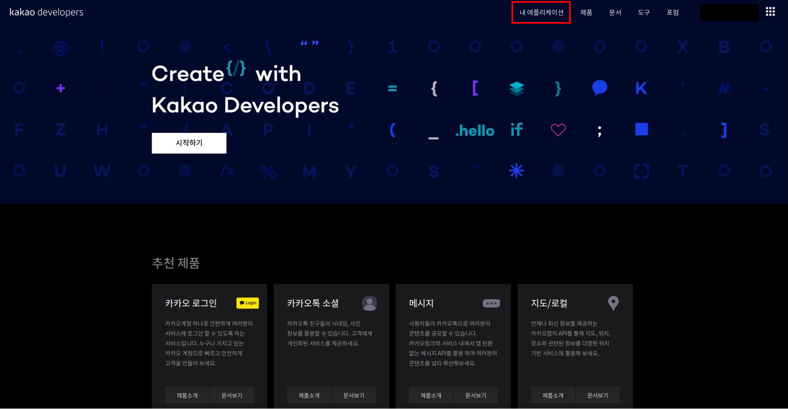 

  2. [어플리케이션 추가하기] 클릭

     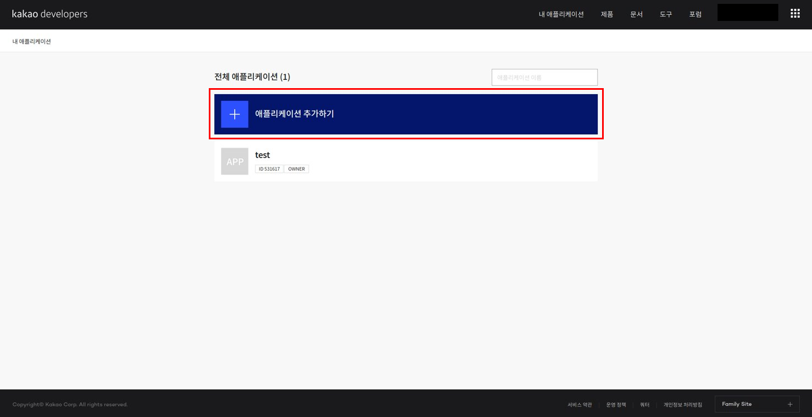 

  3. 앱 이름 및 사업자명 입력 후 저장

     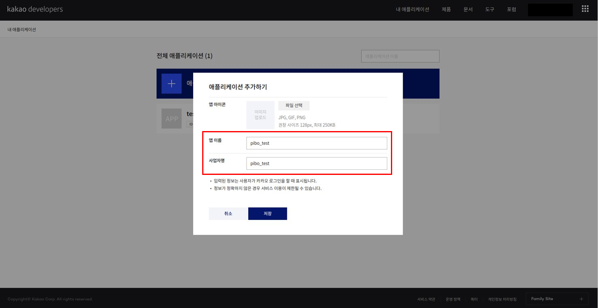 

  4. 새로 생성한 애플리케이션 클릭

      

  5. config.py에 발급받은 API KEY 입력 후, 좌측의 [음성] 클릭

     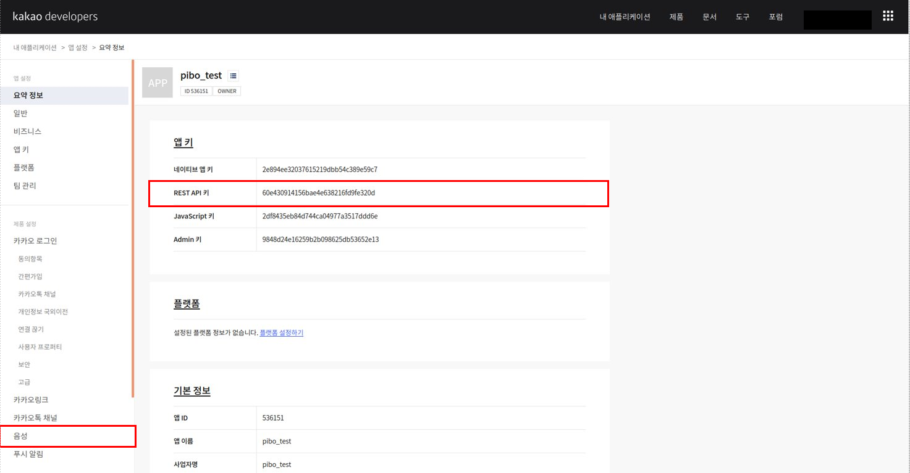 

     - `openpibo-example/utils/config.py`의 KAKAO_ACCOUNT에 발급받은 REST API KEY 입력

     ```python
     # openpibo-example/utils/config.py
     
     class Config:
       OPENPIBO_PATH="/home/pi/openpibo"
       OPENPIBO_DATA_PATH="/home/pi/openpibo-data"
       TESTDATA_PATH =OPENPIBO_DATA_PATH+"/testdata"
       PROC_PATH =OPENPIBO_DATA_PATH+"/proc"
       MODEL_PATH=OPENPIBO_DATA_PATH+"/models"
       KAKAO_ACCOUNT="YOUR REST API KEY"		# 발급받은 REST API KEY 입력
     ```

  6. 활성화 설정의 [OFF] 버튼 클릭

      

  7. 사용 목적 입력 후 저장

     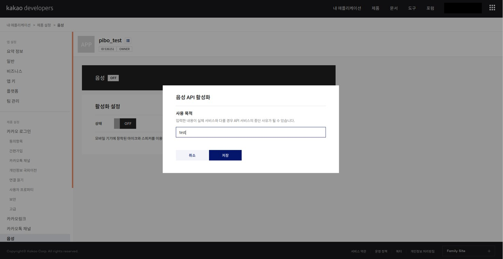 

  8. 활성화 설정의 상태가 [ON]으로 바뀌면 완료

      

### 2.1.2 예제 파일 실행


다음의 코드를 입력하여 예제 파일을 실행할 수 있습니다.

```shell
~ $ git clone https://github.com/themakerrobot/openpibo-example.git
~ $ cd openpibo-example/{폴더명}
~/openpibo-example/{폴더명} $ sudo python3 {파일명}
```

아래는 audio 폴더 내에 있는 play_test.py를 실행하는 예제 코드입니다.

```shell
~ $ cd openpibo-example/audio
~/openpibo-example/audio $ sudo python3 play_test.py
```


## 2.2 예제 파일 코드 설명

openpibo-example의 코드는 다음과 같은 구조를 이루고 있습니다.

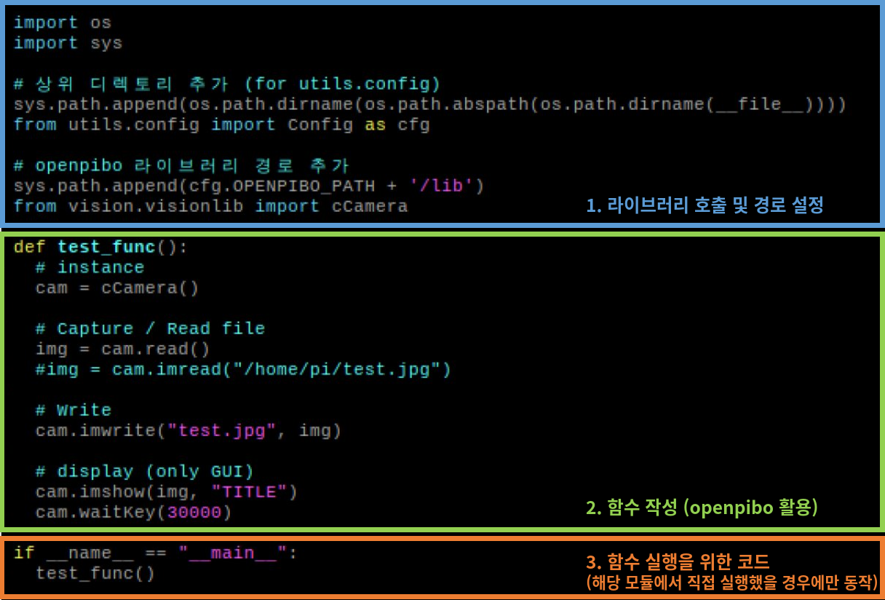 

### 2.2.0 사전 학습

> 예제 파일에 공통으로 들어가는 코드 및 openpibo 라이브러리에 정의되어 있는 함수 사용에 관한 설명입니다.

- **import**

  openpibo의 lib를 import하여 구현합니다. `from {package}.{module} import {class}`

  아래는 openpibo에 있는 audiolib의 cAudio 클래스를 import하는 예제입니다.

  ```python
  # openpibo-example/audio/play_test.py
  
  import os
  import sys
  
  # 상위 디렉토리 추가 (for utils.config)
  sys.path.append(os.path.dirname(os.path.abspath(os.path.dirname(__file__))))
  from utils.config import Config as cfg
  
  # openpibo 라이브러리 경로 추가
  sys.path.append(cfg.OPENPIBO_PATH + '/lib')
  from audio.audiolib import cAudio
  
  ...
  ```

- **함수**

  클래스를 사용하려면 인스턴스를 생성해야 하며, 인스턴스를 통해 해당 클래스의 함수를 호출할 수 있습니다.

  아래는 cAudio 클래스의 함수를 호출하여 test.mp3 파일을 재생하는 코드입니다.

  ```python
  # openpibo-example/audio/play_test.py
  ...
  from audio.audiolib import cAudio
  
  def tts_f():
    obj = cAudio()	# 인스턴스 생성, obj는 cAudio 클래스의 인스턴스
    obj.play(filename=cfg.TESTDATA_PATH+"/test.mp3", out='local', volume=-2000)	# '인스턴스.메서드'로 cAudio 클래스의 play 호출
    time.sleep(5)
    obj.stop()
  
  if __name__ == "__main__":
    tts_f()
  ```

- **함수의 호출** 

  1. 함수 호출 시, 해당 함수가 요구하는 매개변수(parameter)를 같이 넘겨줘야 합니다.

  2. `out='local'`, `volume='-2000'`처럼 기본 인자 값이 설정되어 있는 경우, 인자(argument)를 넘겨주지 않아도 함수 호출이 가능합니다. 

     (호출 시 인자가 없으면 기본 인자 값이 활용됨)

  3. 함수는 기본적으로 인자를 위치로 판단합니다.

  4. 키워드 인자로 전달시 순서가 바뀌어도 함수 호출이 가능합니다.

  아래는 cAudio 클래스 및 함수 호출 예제 코드입니다.

  ```python
  # openpibo/lib/audio/audiolib.py
  
  import os
  
  class cAudio:
      def play(self, filename, out='local', volume='-2000'):
          os.system("omxplayer -o {} --vol {} {} &".format(out, volume, filename))
      def stop(self):
          os.system('sudo pkill omxplayer')
  ```

  ```python
  # play 함수 호출
  obj.play(filename=cfg.TESTDATA_PATH+"/test.mp3", out='local', volume=-2000) # 방법1
  obj.play(filename=cfg.TESTDATA_PATH+"/test.mp3") 							# 방법2 (local, volume 기본 인자값이 있으므로 가능)
  obj.play(cfg.TESTDATA_PATH+"/test.mp3", 'local', -2000)						# 방법3 (인자의 순서가 맞기 때문에 변수명 안써도 가능)
  obj.play(out='local', volume=-2000, filename=cfg.TESTDATA_PATH+"/test.mp3")	# 방법4 (키워드 인자의 경우 순서가 바뀌어도 가능)
  ```

  단, 아래와 같이 키워드 인자를 활용한 뒤에 위치 인자를 활용할 수는 없습니다.

  ```python
  obj.play(filename=cfg.TESTDATA_PATH+"/test.mp3", 'local', -2000)  (X)
  ```

- `if __name__ == "__main__"`

  - `__name__`: 현재 모듈의 이름을 담고 있는 내장 변수입니다.
  - 해당 프로그램을 직접 실행했을 경우, 참이 되어 main 함수를 실행합니다.
  - 다른 프로그램에서 import하여 사용할 경우, main 함수는 실행하지 않습니다.

### 2.2.1 Audio

**play_test.py**

> mp3 파일을 재생 및 정지합니다.

```python
...
from audio.audiolib import cAudio

# test.mp3 파일 5초 재생 후 정지
def tts_f():
  obj = cAudio()
  obj.play(filename=cfg.TESTDATA_PATH+"/test.mp3", out='local', volume=-2000)
  time.sleep(5)	# 5초동안 프로세스 정지
  obj.stop()

if __name__ == "__main__":
  tts_f()
```

**play_test.py 실행**

```shell
pi@raspberrypi:~/openpibo-example/audio $ sudo python3 play_test.py
```

### 2.2.2 Device

**1) device_once_test.py**

> 인자값으로 명령어를 입력하여 파이보를 제어합니다. 

```python
...
from device.devicelib import cDevice

import argparse

def main(args):
  obj = cDevice()
  print('Send:', args.command)		# 실행한 명령어 출력
  data = obj.send_raw(args.command)	# Device에 메시지 전송하고 응답받음
  print('Receive:', data)			# Device로부터 받은 응답 출력
    
if __name__ == "__main__":
  parser = argparse.ArgumentParser()	# 인자값을 받을 수 있는 인스턴스 생성
  parser.add_argument('--command', help='check specific decvice', required=True) #default=0, 입력받고자 하는 인자의 조건 설정
  args = parser.parse_args()			# 명령창(터미널)에 주어진 인자를 파싱하여 args에 저장
  main(args)							# 입력받은 인자값을 인수로 main 함수 실행
```

**device_once_test.py 실행**

아래는 PIBO의 양쪽 눈 색깔을 변경(24)하는 명령어 입력 코드입니다. (command 구조는 [1.3.2 Device제어-참고자료]에 있습니다.)

```shell
pi@raspberrypi:~/openpibo-example/device $ sudo python3 device_once_test.py --command "#24:255,0,0,0,0,255:!"
```

**device_once_test.py 결과**

```shell
Send: #24:255,0,0,0,0,255:!
Receive: 24:oK
```

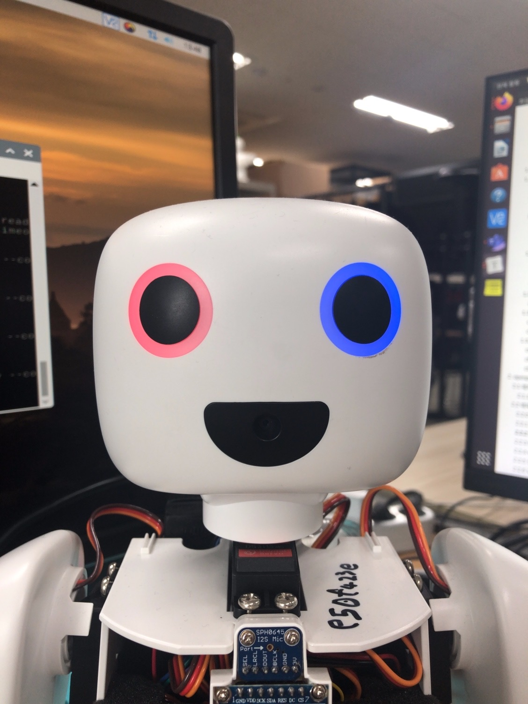

**2) device_test.py**

> 명령어를 입력하여 파이보를 제어합니다. 

```python
...
from device.devicelib import cDevice

if __name__ == "__main__":
  obj = cDevice()
  data = obj.send_cmd(obj.code['PIR'], "on")

  # q를 입력할 때까지 계속해서 명령어 입력 가능
  while True:
    pkt = input("")
    
    if pkt == 'q':
      break
    ret = obj.send_raw(pkt)
    print(ret)
```

**device_test.py 실행**

```shell
pi@raspberrypi:~/openpibo-example/device $ sudo python3 device_test.py
```

**device_test.py 결과**

아래는 PIBO의 눈 색깔을 변경(20), 배터리 체크(15), 버전 확인(10) 명령어를 입력했을 때의 결과입니다.

```shell
#20:255,0,255:!
20:ok
#15:!
15:100%
#10:!
10:FWN200312A
q
```

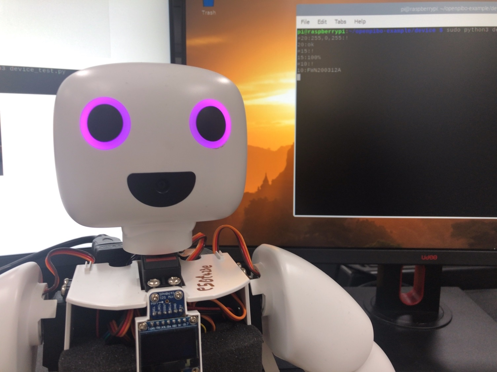

**3) device_test_with_thread.py**

> thread를 사용하여 코드를 병렬 수행합니다.

- 파이썬은 기본적으로 Single Thread에서 순차적으로 코드를 실행합니다.

  따라서, 코드 실행 중 Blocking Function(ex. input)을 만나면 그 함수의 실행이 끝날 때까지 대기합니다.

   이때 threading 모듈을 이용한 multi thread를 사용하면 코드의 병렬 실행이 가능합니다. 

- thread: 프로세스 내에서 실제로 작업을 수행하는 주체, 프로그램(프로세스) 실행 단위 
- daemon thread
  - 메인 스레드가 종료될 때 자신의 실행 상태와 상관없이 종료되는 서브 스레드
  - daemon 속성을 True로 변경하여 사용 (default: False)
  - start()가 호출되기 전에 설정

```python
...
from device.devicelib import cDevice

import time
from threading import Thread, Lock
from queue import Queue

obj = cDevice()
que = Queue()

def decode_pkt(pkt):
  print("Recv:", pkt)

def update():
  # 현재 timestamp 얻기
  system_check_time = time.time()
  battery_check_time = time.time()

  while True:
    # que에 pkt가 존재하면 pkt를 제거하고 반환하여 Device에 메시지 전송 & decode_pkt 실행
    if que.qsize() > 0:
      data = obj.send_raw(que.get())
      decode_pkt(data)

    if time.time() - system_check_time > 1:  # 시스템 메시지 1초 간격 전송
      data = obj.send_cmd(obj.code['SYSTEM'])
      decode_pkt(data)
      system_check_time = time.time()

    if time.time() - battery_check_time > 10: # 배터리 메시지 10초 간격 전송
      data = obj.send_cmd(obj.code['BATTERY'])
      decode_pkt(data)
      battery_check_time = time.time()

    time.sleep(0.01)

if __name__ == "__main__":
  obj.send_cmd(obj.code['PIR'], "on")

  t = Thread(target=update, args=())
  t.daemon = True	# main thread 종료시 update 메서드 종료
  t.start()			# update 메서드 실행

  # main thread  
  # 사용자가 q를 입력할 때까지 무한 반복, que에 pkt 삽입
  while True:
    pkt = input("")
    if pkt == 'q':
      break

    que.put(pkt)
```

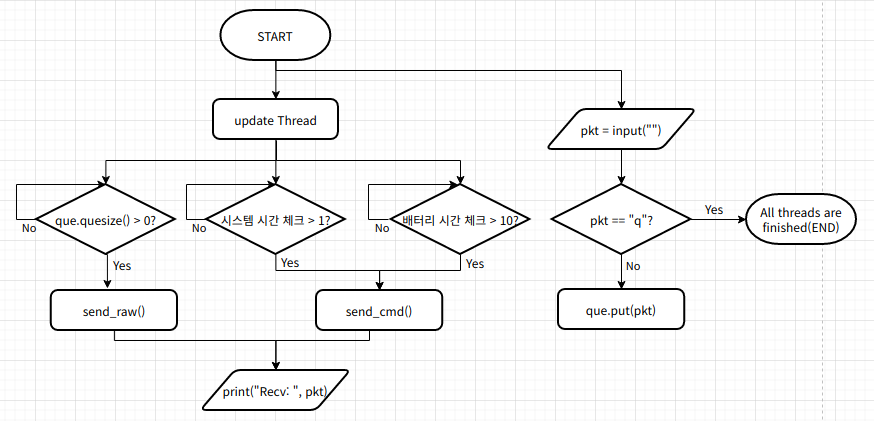 

**device_test_with_thread.py 실행**

```shell
pi@raspberrypi:~/openpibo-example/device $ sudo python3 device_test_with_thread.py 
```

**device_test_with_thread.py 결과**

```shell
Recv: 40:-----
Recv: 40:-----
Recv: 40:-----
Recv: 40:person-----
Recv: 40:person-----
Recv: 40:person-----
Recv: 40:person-----
Recv: 40:person-----
Recv: 40:person-----
Recv: 15:100%
Recv: 40:person-----
Recv: 40:nobody-----
Recv: 40:-----
Recv: 40:-----
Recv: 40:-----
Recv: 40:-----
Recv: 40:-----
Recv: 40:person-----
Recv: 40:person-----
Recv: 40:person-----
Recv: 15:100%
Recv: 40:person-----
Recv: 40:person-----
Recv: 40:person-----
q
```

- 1초마다 PIR Sensor의 값 전송, 10초 간격으로 배터리 메시지 전송
- q 입력시 메인 스레드가 종료되므로 update 메서드 종료

### 2.2.3 Motion

**1) motion_test.py** 

```python
...
from motion.motionlib import cMotion

# wave3 모션 10번 반복
if __name__ == "__main__":
  m = cMotion(conf=cfg)
  m.set_motion(name="wave3", cycle=10)
```

아래는 motion_db.json의 일부입니다. motion_db는 `cMotion.get_motion(name=None)` 함수로 확인할 수 있습니다.( [1.3.3 Motion 생성-cMotion 클래스] 참고 )

```
{
  ...
  "wave3": {
    "comment":"wave",
    "init_def":1,
    "init":[0,0,0,-25,0,0,0,0,0,25],
    "pos":[
      { "d": [   0,   0,   0,  25,   0,   0,  20,   0,   0,  25 ] , "seq": 450 },
      { "d": [ -20, 999, 999, 999, 999, 999, 999, 999, 999, -25 ] , "seq": 900 },
      { "d": [ 999, 999, 999, -25,  20, 999,   0, 999, 999, 999 ] , "seq": 1350 },
      { "d": [   0, 999, 999, 999, 999, 999, 999, 999, 999,  25 ] , "seq": 1800 },
      { "d": [ -20, 999, 999, 999, 999, 999,   0, 999, 999, -25 ] , "seq": 2250 },
      { "d": [ 999, 999, 999,  25, 999, 999,  20, 999, 999, 999 ] , "seq": 2700 },
      { "d": [   0, 999, 999, 999, -20, 999, 999, 999, 999,  25 ] , "seq": 3150 },
      { "d": [ 999, 999, 999, -25, 999, 999,   0, 999, 999, 999 ] , "seq": 3600 }
    ]
  },
  ...
}
```

**motion_test.py 실행**

```shell
pi@raspberrypi:~/openpibo-example/motion $ sudo python3 motion_test.py
```

**2) motor_test.py**

```python
...
from motion.motionlib import cMotion

import time

m = cMotion(conf=cfg)

def move(n, degree, speed, accel):
  m.set_speed(n, speed)			# n번 모터의 속도를 speed로 변경
  m.set_acceleration(n, accel)	# n번 모터의 가속도를 accel로 변경
  m.set_motor(n, degree)		# n번 모터의 위치를 degree로 이동

# 'move() 실행 -> 1초 휴식 -> move() 실행 -> 1초 휴식'을 무한 반복
def test():
  while True:
    move(2, 30, 100, 10)
    move(8, 30,  10, 10)
    time.sleep(1)	# 단위: 초(sec)

    move(2, -30, 100, 10)
    move(8, -30,  10, 10)
    time.sleep(1)

if __name__ == "__main__":
  test()
```

**motor_test.py 실행**

```shell
pi@raspberrypi:~/openpibo-example/motion $ sudo python3 motor_test.py 
```

**3) multi_motor_test.py**

```python
...
from motion.motionlib import cMotion

import time

# 'set_motors() 실행 -> 1.1초 휴식 -> set_motors() 실행 -> 1.1초 휴식'을 무한 반복
def move_test():
  m = cMotion(conf=cfg)

  while True:
    m.set_motors(positions=[0,0,30,20, 30,0, 0,0,30,20], movetime=1000)
    time.sleep(1.1)
    m.set_motors(positions=[0,0,-30,-20, -30,0, 0,0,-30,-20], movetime=1000)
    time.sleep(1.1)

if __name__ == "__main__":
  move_test()
```

**multi_motor_test.py 실행**

```shell
pi@raspberrypi:~/openpibo-example/motion $ sudo python3 multi_motor_test.py
```

**4) pymotor_test.py**

```python
...
from motion.motionlib import cPyMotion

import time

m = cPyMotion()

def move(n, speed, accel, degree):
  m.set_speed(n, speed)
  m.set_acceleration(n, accel)
  m.set_motor(n, degree)

# 2초 간격으로 move() 실행 무한 반복
def test():
  while True:
    move(2, 50, 0, 30)
    time.sleep(2)
  
    move(2, 50, 10, -30)
    time.sleep(2)

# Init 출력 -> move() -> 1초  휴식 -> Start 출력 -> test()
if __name__ == "__main__":
  print("Init")
  move(2, 20, 0, 0)
  time.sleep(1)

  print("Start")
  test()
```

**pymotor_test.py 실행**

```shell
pi@raspberrypi:~/openpibo-example/motion $ sudo python3 pymotor_test.py 
```

**pymotor_test.py 결과**

```shell
Init
Start
```

### 2.2.4 OLED

**1) figure_test.py**

> OLED display에 도형과 선을 출력합니다.

```python
...
from oled.oledlib import cOled

import time

def oled_f():
  oObj = cOled(conf=cfg)
  oObj.clear()								# 화면 지우기
  oObj.draw_rectangle((10,10,30,30) ,True)	# 길이가 20인 채워진 사각형 그리기
  oObj.draw_ellipse((70,40,90,60) ,False)	# 지름이 20인 빈 원 그리기
  oObj.draw_line((15,15,80,50))				# 선 그리기
  oObj.show()								# 화면에 표시

if __name__ == "__main__":
  oled_f()
```

**figure_test.py 실행**

```shell
pi@raspberrypi:~/openpibo-example/oled $ sudo python3 figure_test.py 
```

**figure_test.py 결과**

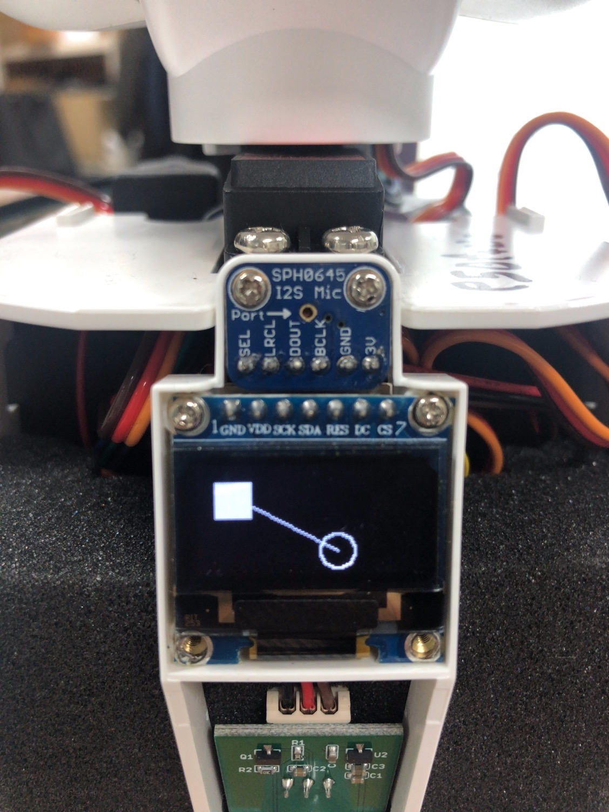

**2) image_test.py**

> OLED display에 이미지를 출력합니다. (128X64만 가능합니다.)

```python
...
from oled.oledlib import cOled

import time

# 화면에 clear.png 이미지 5초간 표시
def oled_f():
  oObj = cOled(conf=cfg)
  oObj.draw_image(cfg.TESTDATA_PATH +"/clear.png")	# clear.png 그리기
  oObj.show()		# 화면에 표시
  time.sleep(5)		# 5초동안 프로세스 정지
  oObj.clear()		# 화면 지우기
  oObj.show()

if __name__ == "__main__":
  oled_f()
```

**image_test.py 실행**

```shell
pi@raspberrypi:~/openpibo-example/oled $ sudo python3 image_test.py
```

**image_test.py 결과**

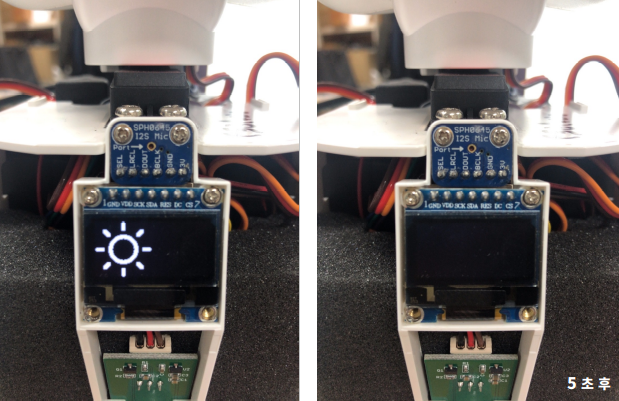

**3) self_test.py**

> 직접 실습해보세요.

```python
...
from oled.oledlib import cOled

def oled_f():
  print('my oled design')


if __name__ == "__main__":
  oled_f()
```

**self_test.py 실행**

```shell
pi@raspberrypi:~/openpibo-example/oled $ sudo python3 self_test.py
```

**4) text_test.py**

> OLED display에 문자열을 출력합니다.

```python
...
from oled.oledlib import cOled

# (0,0), (0,20)에 15 크기의 text 표시
def oled_f():
  oObj = cOled(conf=cfg)
  oObj.set_font(size=15)
  
  oObj.draw_text((0, 0), "안녕? 난 파이보야 ")	  # (0,0)에 문자열 출력
  oObj.draw_text((0,20), "☆  ★ ")			# (0,20)에 문자열 출력
  oObj.show()	# 화면에 표시

'''
  for count in range(5):
    oObj.clear()
    oObj.draw_text((10,10), "Hello World:{}".format(count))
    oObj.show()
    time.sleep(1)
  oObj.clear()
'''

if __name__ == "__main__":
  oled_f()
```

**text_test.py 실행**

```shell
pi@raspberrypi:~/openpibo-example/oled $ sudo python3 text_test.py
```

**text_test.py 결과**

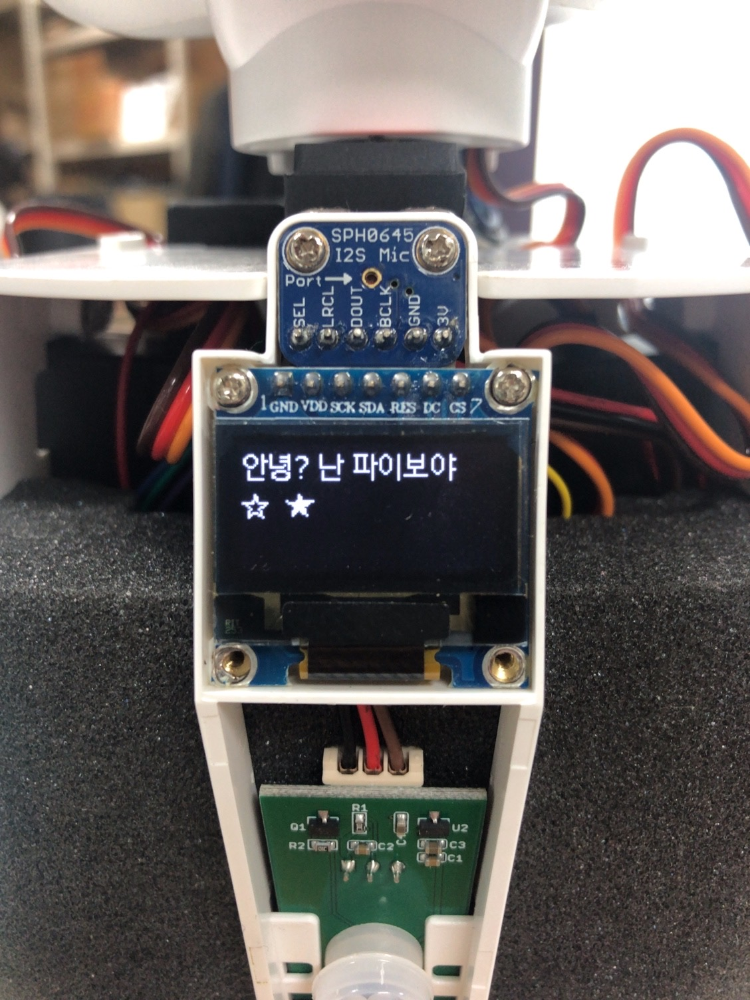

### 2.2.5 Speech

**1) chatbot_test.py**

> 입력한 문장에 대해 형태소 분석을 실시하여 파이보와 대화를 시작합니다.
>
> 사용자가 입력한 문장에 db의 key 값(날씨, 음악, 뉴스)이 있으면 해당 함수를 실행하고, 없다면 대화봇을 실행합니다.

```python
...
from speech.speechlib import cDialog

def weather(cmd):
  lst, _type = ["오늘", "내일"], None
  
  # 분석한 문장 중 "오늘", "내일"이 있다면 _type=item으로 설정
  for item in lst:
    if item in cmd:
      _type = item

  if _type == None:
    print("BOT > 오늘, 내일 날씨만 가능해요. ")
  else:
    print("BOT > {} 뉴스 알려줄게요.".format(_type))


def music(cmd):
  lst, _type = ["발라드", "댄스", "락"], None

  # 분석한 문장 중 "발라드", "댄스", "락"이 있다면 _type=item으로 설정
  for item in lst:
    if item in cmd:
      _type = item

  if _type == None:
    print("BOT > 발라드, 락, 댄스 음악만 가능해요.")
  else:
    print("BOT > {} 음악 틀어줄게요.".format(_type))

def news(cmd):
  lst, _type = ["경제", "스포츠", "문화"], None

  # 분석한 문장 중 "경제", "스포츠", "문화"가 있다면 _type=item으로 설정
  for item in lst:
    if item in cmd:
      _type = item

  if _type == None:
    print("BOT > 경제, 문화, 스포츠 뉴스만 가능해요.")
  else:
    print("BOT > {} 뉴스 알려줄게요.".format(_type))

db = {
  "날씨":weather,
  "음악":music, 
  "뉴스":news,
}

# 사용자가 입력한 문장에 대해 형태소 분석을 실시하여 파이보가 실행하는 함수가 달라짐
def main():
  obj = cDialog(conf=cfg)
  print("대화 시작합니다.")
  while True:
    c = input("입력 > ")
    matched = False
    if c == "그만":
      break
	
    # 사용자가 입력한 질문에 대한 형태소 분석
    d = obj.mecab_morphs(c)
    #print("형태소 분석: ", d)
    # 분석한 문장 중 "날씨", "음악", "뉴스"가 있다면 해당 key값의 함수 실행
    for key in db.keys():
      if key in d:
        db[key](d)
        matched = True
	
    # key 값이 없다면 대화봇 실행
    if matched == False:
      print("대화봇 > ", obj.get_dialog(c))

if __name__ == "__main__":
  main()
```

  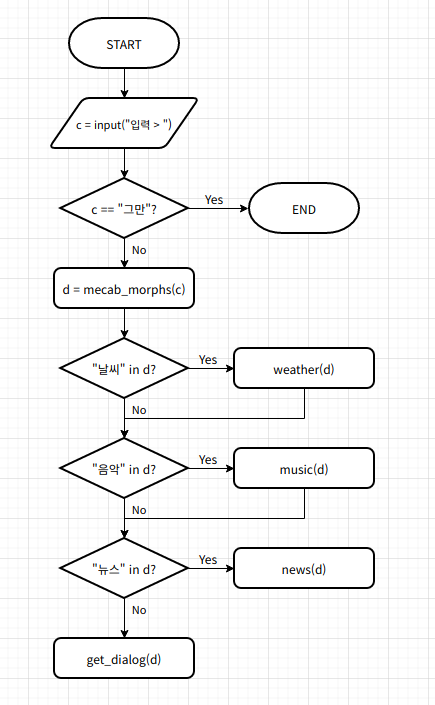 

**chatbot_test.py 실행**

```shell
pi@raspberrypi:~/openpibo-example/speech $ sudo python3 chatbot_test.py 
```

**chatbot_test.py 결과**

```shell
대화 시작합니다.
입력 > 댄스 음악 추천해줘
BOT > 댄스 음악 틀어줄게요.
입력 > 주말에 뭐하지
대화봇 >  사탕 만들어요.
입력 > 사탕 싫어
대화봇 >  싫어하지 말아요.
입력 > 그만
```

**2) mecab_test.py**

> 사용자가 입력한 문장을 분석합니다. 3가지 모드 선택이 가능합니다.

```python
...
from speech.speechlib import cDialog

# mode(pos, morphs, nouns)에 따른 문장 분석
def mecab_f(string, mode):
  print("Input: ", string)
  obj = cDialog(conf=cfg)
  
  if mode == "pos":
    data = obj.mecab_pos(string)
  elif mode == "morphs":
    data = obj.mecab_morphs(string)
  elif mode == "nouns":
    data = obj.mecab_nouns(string)
  print("Output: ", data)

if __name__ == "__main__":
  mecab_f("아버지 가방에 들어가신다", "nouns")
```

**mecab_test.py 실행**

```shell
pi@raspberrypi:~/openpibo-example/speech $ sudo python3 mecab_test.py 
```

**mecab_test.py 결과**

```shell
Input:  아버지 가방에 들어가신다
Output:  ['아버지', '가방']

# (+) pos 결과
Input:  아버지 가방에 들어가신다
Output:  [('아버지', 'NNG'), ('가방', 'NNG'), ('에', 'JKB'), ('들어가', 'VV'), ('신다', 'EP+EC')]

# (+) morphs 결과
Input:  아버지 가방에 들어가신다
Output:  ['아버지', '가방', '에', '들어가', '신다']
```

- NNG: 일반 명사 / JKB: 부사격 조사 / VV: 동사 / EP: 선어말 어미 / EC: 연결 어미

  ( 품사 태그표: https://docs.google.com/spreadsheets/d/1OGAjUvalBuX-oZvZ_-9tEfYD2gQe7hTGsgUpiiBSXI8/edit#gid=0 )

**3) stt_test.py**

```python
...
from speech.speechlib import cSpeech

obj = cSpeech(conf=cfg)
# 음성 언어를 문자 데이터로 변환하여 출력
ret = obj.stt()
print(ret)
```

**stt_test.py 실행**

```shell
pi@raspberrypi:~/openpibo-example/speech $ sudo python3 stt_test.py 
```

**4) translate_test.py**

> 문장을 번역합니다.

```python
...
from speech.speechlib import cSpeech

# "안녕하세요"를 영어로 번역 후 출력
def translate_f():
  obj = cSpeech(conf=cfg)
  string = "안녕하세요"
  ret = obj.translate(string, to="en")
  print("Input:", string)
  print("Output:", ret)

if __name__ == "__main__":
  translate_f()
```

**translate_test.py 실행**

```shell
pi@raspberrypi:~/openpibo-example/speech $ sudo python3 translate_test.py 
```

**translate_test.py 결과**

```shell
Input: 안녕하세요
Output: Good morning 
```

**5) tts_test.py**

> 문자 데이터를 음성 언어로 변환합니다.

```python
...
from speech.speechlib import cSpeech
from audio.audiolib import cAudio

# tts.mp3 파일의 문자 데이터를 음성 언어로 변환 후, 파이보 스피커에 출력
def tts_f():
  tObj = cSpeech(conf=cfg)
  filename = cfg.TESTDATA_PATH+"/tts.mp3"
  tObj.tts("<speak>\
              <voice name='MAN_READ_CALM'>안녕하세요. 반갑습니다.<break time='500ms'/></voice>\
            </speak>"\
          , filename)
  print(filename)
  aObj = cAudio()
  aObj.play(filename, out='local', volume=-1500)	#  파이보 스피커로 filename 출력

if __name__ == "__main__":
  tts_f()
```

- speak

  - 기본적으로 모든 음성은 태그로 감싸져야 한다.
  - 태그 하위로 `,`를 제외한 모든 태그가 존재할 수 있다.
  - 문장, 문단 단위로 적용하는 것을 원칙으로 한다. 한 문장 안에서 단어별로 태그를 감싸지 않는다.

  ```
  <speak> 안녕하세요. 반가워요. </speak>
  ```

- voice

  - 음성의 목소리를 변경하기 위해 사용하며, name attribute를 통해 원하는 목소리를 지정한다. 제공되는 목소리는 4가지이다.
    - WOMAN_READ_CALM: 여성 차분한 낭독체 (default)
    - MAN_READ_CALM: 남성 차분한 낭독체
    - WOMAN_DIALOG_BRIGHT: 여성 밝은 대화체
    - MAN_DIALOG_BRIGHT: 남성 밝은 대화체
  - 하위로 `,`를 제외한 모든 태그(kakao: effet, prosody, break, audio, say-as, sub)가 존재할 수 있다.
  - 문장, 문단 단위로 적용하는 것을 원칙으로 한다. 한 문장 안에서 단어별로 태그를 감싸지 않는다.

  ```
  <speak>
  <voice name="WOMAN_READ_CALM"> 지금은 여성 차분한 낭독체입니다.</voice>
  <voice name="MAN_READ_CALM"> 지금은 남성 차분한 낭독체입니다.</voice>
  <voice name="WOMAN_DIALOG_BRIGHT"> 안녕하세요. 여성 밝은 대화체예요.</voice>
  <voice name="MAN_DIALOG_BRIGHT"> 안녕하세요. 남성 밝은 대화체예요.</voice>
  </speak>
  ```

**tts_test.py 실행**

```shell
pi@raspberrypi:~/openpibo-example/speech $ sudo python3 tts_test.py 
```

### 2.2.6 Vision

- OpenCV DNN 모듈

  - 딥러닝 학습은 Caffe 프레임워크에서 진행하고, 학습된 모델을 dnn 모듈로 불러와서 실행(`cv2.dnn.readNet()`)

**1) camera_test.py**

> 사진을 촬영하고 저장합니다.

```python
...
from vision.visionlib import cCamera

def test_func():
  # instance
  cam = cCamera()

  # Capture / Read file
  # 이미지 촬영
  img = cam.read()
  #img = cam.imread("/home/pi/test.jpg")

  # Write(test.jpg라는 이름을 촬영한 이미지 저장)
  cam.imwrite("test.jpg", img)

  # display (only GUI): 3초동안 'TITLE'이라는 제목으로 이미지 보여줌
  cam.imshow(img, "TITLE")
  cam.waitKey(3000)	# 단위: ms

if __name__ == "__main__":
  test_func()
```

**camera_test.py 실행**

```shell
pi@raspberrypi:~/openpibo-example/vision $ sudo python3 camera_test.py 
```

**camera_test.py 결과**

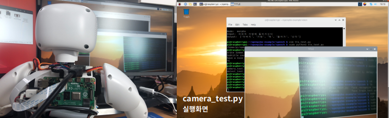

**2) detect_test.py**

> 이미지의 객체/QR코드/문자를 인식합니다.

```python
...
from vision.visionlib import cCamera
from vision.visionlib import cDetect

def test_func():
  cam = cCamera()	# cCamera 클래스에 대한 객체 생성
  det = cDetect(conf=cfg)

  # Capture / Read file
  img = cam.read()
  #img = cam.imread("image.jpg")

  print("Object Detect: ", det.detect_object(img))	# 객체 인식
  print("Qr Detect:", det.detect_qr(img))			# QR코드 인식
  print("Text Detect:", det.detect_text(img))		# 문자 인식

if __name__ == "__main__":
  test_func()
```

**detect_test.py 실행**

```shell
pi@raspberrypi:~/openpibo-example/vision $ sudo python3 detect_test.py 
```

**detect_test.py 결과**

```shell
Object Detect:  [{'name': 'bus', 'score': 80.67924976348877, 'position': (2, 0, 627, 478)}]
Qr Detect: {'data': 'http://www.wando.go.kr/l04xd2@', 'type': 'QRCODE'}
Text Detect: ’
> fxr
cends, This restaurant has ungie portions
—ARBTSORE
ㅅ 피 메 엔 로
oO a |
Fs
```

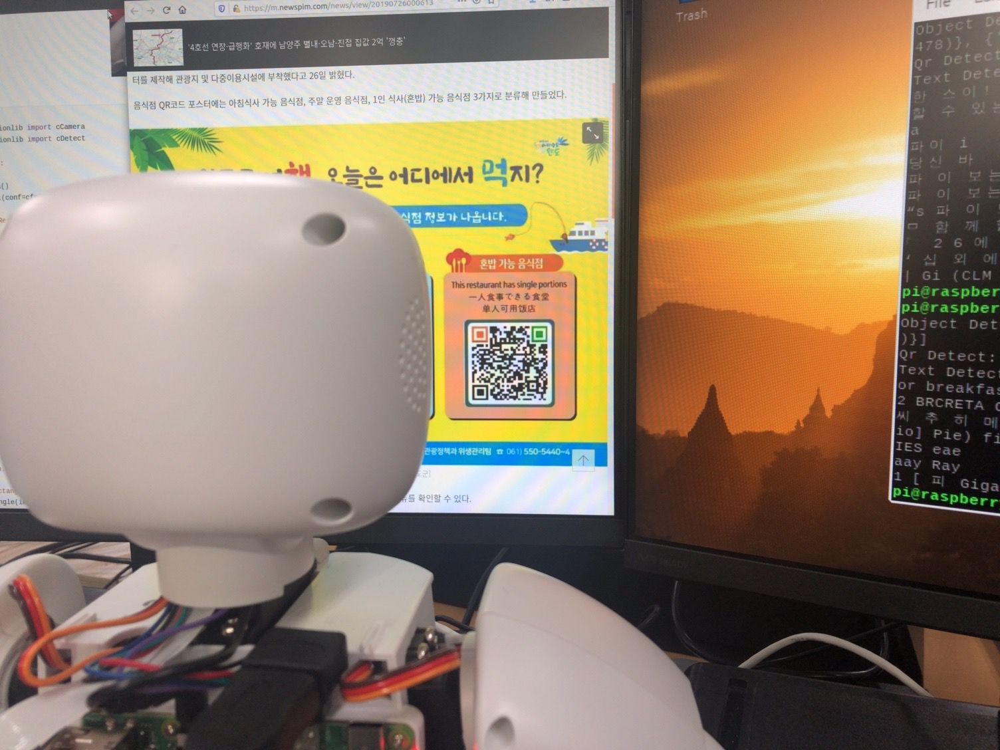

**3) draw_test.py**

> 이미지에 그림과 글씨를 입력합니다.

```python
...
from vision.visionlib import cCamera

def test_func():
  cam = cCamera()

  # Capture / Read file
  img = cam.read()
  #img = cam.imread("/home/pi/test.jpg")

  cam.rectangle(img, (100,100), (300,300), thickness=2)		# 화면의 (100,100), (300,300) 위치에 사각형 그리기
  cam.putText(img, "Hello Camera", (50, 50), thickness=2)	# 화면의 (50,50) Hello Camera 쓰기

  cam.imwrite("test.jpg", img)	# test.jpg로 이미지 저장

  # display (only GUI): 3초동안 'TITLE'이라는 제목으로 이미지 보여줌
  cam.imshow(img, "TITLE")
  cam.waitKey(3000)

if __name__ == "__main__":
  test_func()
```

**draw_test.py 실행**

```shell
pi@raspberrypi:~/openpibo-example/vision $ sudo python3 draw_test.py
```

**draw_test.py 결과**

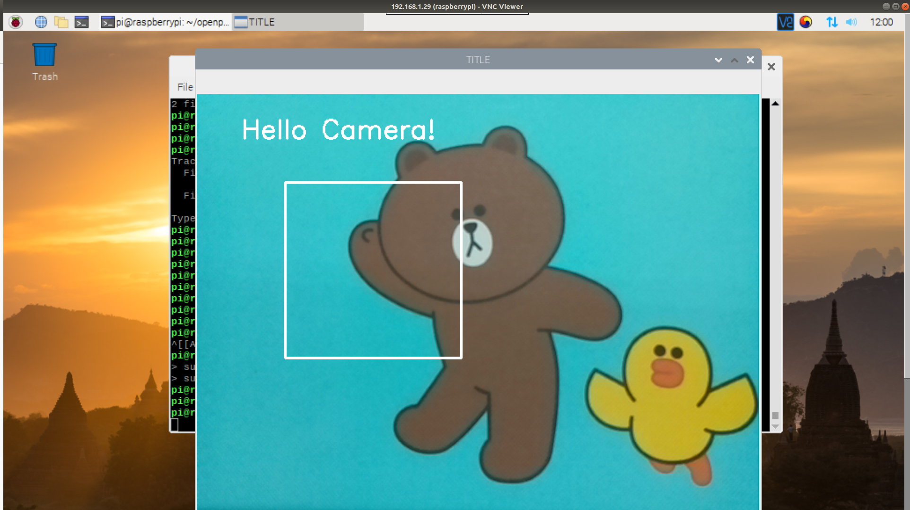

**4) face_recognize_test.py**

> 이미지에서 얼굴을 찾아 나이와 성별을 추정합니다. 

```python
...
from vision.visionlib import cCamera
from vision.visionlib import cFace

def test_f():
  cam = cCamera()
  faceObj = cFace(conf=cfg)

  # 이미지 촬영
  img = cam.read()
  #img = cam.imread("/home/pi/test.jpg")
 
  disp = img.copy()

  # 이미지에서 얼굴 탐색
  faceList = faceObj.detect(img)

  if len(faceList) < 1:
    print("No face")
    return 
 
  # 나이, 성별 추정
  ret = faceObj.get_ageGender(img, faceList[0])
  age = ret["age"]
  gender = ret["gender"]

  # 얼굴 위치 좌표에 사각형 그리기
  x,y,w,h = faceList[0]  
  cam.rectangle(disp, (x,y), (x+w, y+h))

  # 등록된 얼굴 인식(동일인이라 판정되면 이름, 아니면 Guest)
  ret = faceObj.recognize(img, faceList[0])
  name = "Guest" if ret == False else ret["name"]

  cam.putText(disp, "{}/ {} {}".format(name,gender,age), (x-10, y-10), size=0.5)

  # 모니터에서 3초간 VIEW라는 제목으로 이미지 확인
  cam.imshow(disp, "VIEW")
  cam.waitKey(3000)

  # test.jpg로 이미지 저장
  cam.imwrite("test.jpg", disp)

if __name__ == "__main__":
  test_f()
```

**face_recognize_test.py 실행**

```shell
pi@raspberrypi:~/openpibo-example/vision $ sudo python3 face_recognize_test.py 
```

**face_recognize_test.py 결과**

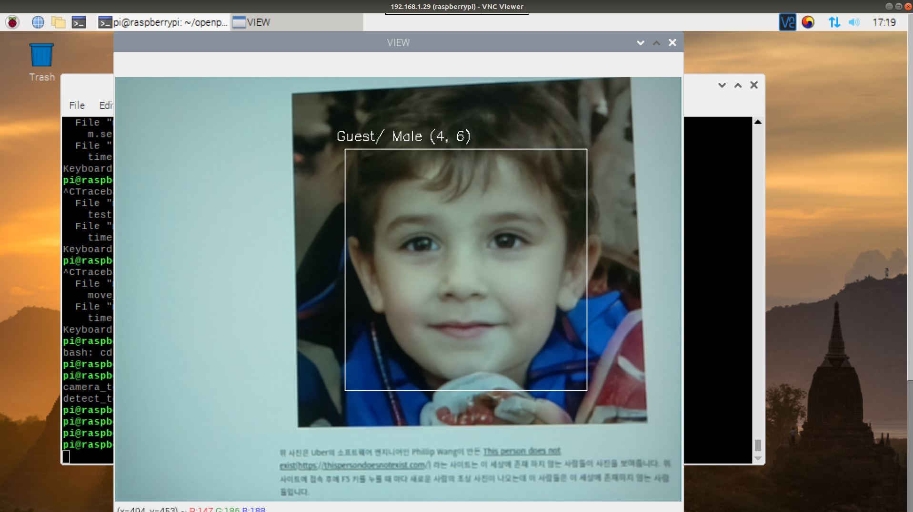

**5) face_train_test.py**

> 이미지에서 얼굴을 찾아 학습하여 데이터베이스에 저장하고 로드한  뒤 다시 삭제합니다.

```python
...
from vision.visionlib import cCamera
from vision.visionlib import cFace

def test_func():
  cam = cCamera()
  faceObj = cFace(conf=cfg)

  print("Start DB:", faceObj.get_db()[0])
  
  # 이미지 촬영
  img = cam.read()
  #img = cam.imread("/home/pi/test.jpg")

  faces = faceObj.detect(img)
  if len(faces) < 1:
    print(" No face")
  else:
    # 얼굴 학습(학습할  이미지 데이터, 얼굴 1개 위치, 학습할 얼굴 이름)
    print(" Train:", faceObj.train_face(img, faces[0], "yjlee"))
  print("After Train, DB:", faceObj.get_db()[0])

  img = cam.read()
  faces = faceObj.detect(img)
  if len(faces) < 1:
    print(" No face")
  else:
    print(" Recognize:", faceObj.recognize(img, faces[0]))

  # 얼굴 데이터베이스를 파일로 저장
  faceObj.save_db("./facedb")

  # 얼굴 데이터베이스 초기화
  faceObj.init_db()
  print("After reset db, DB:", faceObj.get_db()[0])
  
  # 얼굴 데이터베이스 파일 로드
  faceObj.load_db("facedb")
  print("After Load db, DB:", faceObj.get_db()[0])

  # 등록된 얼굴 삭제
  faceObj.delete_face("yjlee")
  print("After Delete face:", faceObj.get_db()[0])

if __name__ == "__main__":
  test_func()
```

**face_train_test.py 실행**

```shell
pi@raspberrypi:~/openpibo-example/vision $ sudo python3 face_train_test.py
```

**face_train_test.py 결과**

```python
Start DB: []
 Train: None
After Train, DB: ['yjlee']
 Recognize: {'name': 'yjlee', 'score': 0.02}
After reset db, DB: []
After Load db, DB: ['yjlee']
After Delete face: []
```

**6) streaming_test.py**

> 모니터에 이미지를 스트리밍합니다.

```python
...
from vision.visionlib import cCamera

# 모니터에 3초간 이미지 스트리밍
def test_func():
  # instance
  cam = cCamera()

  # For streaming (only GUI)
  cam.streaming(timeout=3)

if __name__ == "__main__":
  test_func()
```

**streaming_test.py 실행**

```shell
pi@raspberrypi:~/openpibo-example/vision $ sudo python3 streaming_test.py 
```

**streaming_test.py 결과**

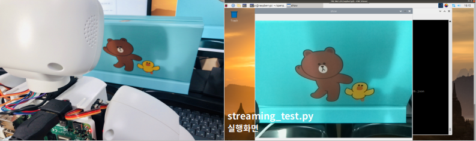